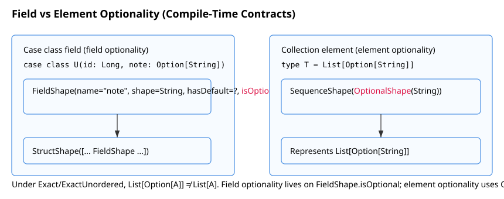

# flowforge - Type‑safe-first Data Engineering


[](https://github.com/vim89/flowforge/actions/workflows/nightly.yml)
[](https://app.codecov.io/gh/vim89/flowforge)
[](https://app.codecov.io/gh/vim89/flowforge/flags/core)
[](https://app.codecov.io/gh/vim89/flowforge/flags/contracts)
[](https://app.codecov.io/gh/vim89/flowforge/flags/connectors)
[](https://app.codecov.io/gh/vim89/flowforge/flags/infrastructure)
[](https://vim89.github.io/flowforge/api/)
[](https://github.com/vim89/flowforge/actions/workflows/docs-lint.yml)
[](https://github.com/vim89/flowforge/actions/workflows/link-check.yml)
[](https://github.com/vim89/flowforge/actions/workflows/security.yml)
[](CHANGELOG.md)


[](docs/start-here.md)

> Build pipelines that won’t even compile when contracts drift. Keep transformations pure, put effects at the edges, and run on Spark and Flink.

## Why (beliefs)

- Runtime schema drift burns weekends. We believe failures should move left - into the compiler.
- Side‑effects inside transforms amplify retries/speculation. We believe effects belong at the edges and must be idempotent.
- Engineers deserve fast, local feedback. We believe pure transformations and compile‑fail tests make data engineering joyful again.

### _A story:_ 
"A partner team removed a nullable column late Friday. We couldn’t roll back in time; both teams were up all night. If that change had been a compile error, we would have slept."

### For Python/ETL folks (dbt/Airflow/Informatica/Talend): 
Think "contracts like Pydantic/Avro — but enforced before jobs run," "pure functions you can test without a cluster," and "connectors/engines that make IO explicit and safe."

### For EMs / Staff Data Architects: 
You get compile‑time guarantees (not CI or runtime heuristics), a small opinionated surface, and batteries‑included defaults with escape hatches.

## How (principles)

- **Compile‑time contracts:** `SchemaConforms[Out, Contract, Policy]` proves compatibility; policies include **Exact**, **Backward**, **Forward** (+ Ordered/CI/ByPosition). See [docs/how-it-fails.md](docs/how-it-fails.md).
- **Typestate builder:** `build()` exists only when source, transforms, and sink are present. Incomplete pipelines are unbuildable.
- **Pure vs effect boundary:** transforms are pure functions; `F[_]` only at IO edges; engines plug into a single algebra.
- **Pictures over prose:** see [flowchart.svg](docs/diagrams/compile-time-contracts/flowchart.svg) and [optionality.md](docs/diagrams/compile-time-contracts/optionality.md).

## What (The framework)

- Core: contracts, builder, EffectSystem, DataAlgebra.
- Engines: Spark (primary 1.0), Flink (2.12 only).
- Connectors: filesystem, JDBC, GCS (more coming).
- Data Quality: native checks by default; optional Deequ when present.
- Template: flowforge.g8 for new projects.

## Diagrams (pictures > words)









## Quick links
- Getting started quick: [docs/getting-started.md](docs/getting-started.md)
- Full start: [docs/getting-started.md](docs/getting-started.md)
- Public API: [docs/public-api.md](docs/public-api.md)
- How it fails (error anatomy): [docs/how-it-fails.md](docs/how-it-fails.md)
- Framework behaviors (non‑negotiables): [docs/design/framework-behaviors.md](docs/design/framework-behaviors.md)
- Cut a release: [docs/release/how-to-cut-a-release.md](docs/release/how-to-cut-a-release.md)

### Module status (coverage)

>Nightly runs provide broader integration coverage.

- Core: [](https://app.codecov.io/gh/vim89/flowforge/flags/core)
- Contracts: [](https://app.codecov.io/gh/vim89/flowforge/flags/contracts)
- Connectors: [](https://app.codecov.io/gh/vim89/flowforge/flags/connectors)
- Infrastructure: [](https://app.codecov.io/gh/vim89/flowforge/flags/infrastructure)

## Guarantees (Non‑negotiables)

- Compile‑fail contracts for typed endpoints under policy lattice
- Typestate builder: `build()` only when complete — incomplete pipelines can’t compile
- Pure transforms; effectful edges; idempotent side‑effects by design
- See: docs/design/framework-behaviors.md

## 10‑Minute quickstart

Prereq: JDK 17+, sbt 1.9+

**1) Clone & build**
```bash
git clone https://github.com/vim89/flowforge.git && cd flowforge
sbt compile
```

**2) See a compile‑time contract failure (red → green)**
```scala
// Paste in REPL or a scratch test to feel it
import com.flowforge.core.contracts._
final case class Out(id: Long)
final case class Contract(id: Long, email: String)
implicitly[SchemaConforms[Out, Contract, SchemaPolicy.Exact]] // ❌ compile‑time error (missing email)
```
Relax the policy to Backward (allows extra producer fields and missing optional/defaults):
```scala
implicitly[SchemaConforms[Out, Contract, SchemaPolicy.Backward]] // ✅
```

**3) Build a pipeline — typestate forbids incomplete builds**
```scala
import cats.effect.IO
import com.flowforge.core.PipelineBuilder
import com.flowforge.core.types._
import com.flowforge.core.contracts._

final case class User(id: Long, email: String)
val src  = TypedSource[User](LocalDataSource("/tmp/in", DataFormat.Parquet))
val sink = TypedSink[User](LocalDataSink("/tmp/out", DataFormat.Parquet))

PipelineBuilder[IO]("demo")
  .addTypedSource[User, User, SchemaPolicy.Exact](src, _ => IO.pure(User(1, "a@b")))
  .noTransform
  .addTypedSink[User, SchemaPolicy.Exact](sink, (_, _) => IO.unit)
  .build() // ✅ build is available only now
```

**4) Explore diagrams and failure messages**
- Diagrams: [flowchart.svg](docs/diagrams/compile-time-contracts/flowchart.svg), [optionality.md](docs/diagrams/compile-time-contracts/optionality.md)
- Failure anatomy: [docs/how-it-fails.md](docs/how-it-fails.md)

### Quickstart paths

| Path | Goal | Commands |
|------|------|----------|
| A — Examples | Try locally (no cluster) | `sbt ffDev` (compile + focused tests), `sbt ffRunSpark` (Spark local[*]) |
| B — Red→Green | See compile‑time error then fix | Use the snippet above; run `sbt compile` |
| C — New project | Scaffold with g8 | `sbt new flowforge.g8 --name="ff-demo" --organization="com.acme"` then `sbt test` / `sbt run` |

## Compatibility

| Component | Version | Notes |
|-----------|---------|-------|
| JDK | 17+ | CI pinned to 17; Spark 3.5.x compatibility |
| sbt | 1.9+ |  |
| Scala | 2.13 (primary) | Scala 3 for core only (no Spark deps) |
| Spark | 3.5.x | Runs on Java 17 |
| Flink | Scala 2.12 only | Scala API constraints |

### Flink (2.12)

Flink’s Scala API is 2.12‑only. The root build excludes Flink from the default aggregate so that `+compile`, `+test:compile`, and `+test` stay green for 2.13 (and Scala 3 where applicable). Build/test Flink explicitly when you need it:

```
# Compile Flink (Scala 2.12)
sbt "++2.12.* enginesFlink/compile"

# Run Flink tests (Scala 2.12)
sbt "++2.12.* enginesFlink/test"
```

References: Flink documents binary incompatibility across Scala lines and the need to select the matching `_2.12` artifacts for the Scala API. See Flink’s docs on Scala versions and sbt cross‑build guidance. 

## Architecture (at a glance)

The diagrams above summarize derivation and policy checks; see also [docs/diagrams/compile-time-contracts/guide.md](docs/diagrams/compile-time-contracts/guide.md) for narrative.

## Examples & demos

- Examples module: [modules/examples](modules/examples) (runnable demos)
- Optional Deequ mode: add `-Dff.quality.mode=deequ` (auto‑enables when on classpath)

## Documentation map

- Start here: [docs/start-here.md](docs/start-here.md); quick: [docs/getting-started.md](docs/getting-started.md)
- Why compile‑time: [docs/why-compile-time.md](docs/why-compile-time.md)
- How it fails: [docs/how-it-fails.md](docs/how-it-fails.md)
- Public API: [docs/public-api.md](docs/public-api.md)
- ADR index: [docs/adr/INDEX.md](docs/adr/INDEX.md)
- Evidence: [docs/evidence](docs/evidence) (e.g., [scala3-alignment.md](docs/evidence/scala3-alignment.md))
- Plan & Readiness: [docs/plan/v1.0-readiness.md](docs/plan/v1.0-readiness.md), [docs/quality/release-criteria.md](docs/quality/release-criteria.md)
- Talks: [docs/talks](docs/talks) (WHY→HOW→WHAT outline)

## Release & versioning

- CHANGELOG: [CHANGELOG.md](CHANGELOG.md)
- Security: [SECURITY.md](SECURITY.md)
- v1.0 Plan/Readiness: [docs/plan/v1.0-readiness.md](docs/plan/v1.0-readiness.md), [docs/quality/release-criteria.md](docs/quality/release-criteria.md)

## FAQ

- Scala 3?
  - Core compiles on Scala 3; engines depend on Spark/Flink ecosystem (Spark 3.x limits Scala 3 today).
- Why compile‑time vs tests?
  - Tests are sampled; compile‑time proofs are exhaustive for shapes and policy compatibility.
- How does this compare to Databricks DLT/Dagster/dbt?
  - They perform runtime/CI checks; FlowForge enforces compile‑time gates and typestate builder. See docs/evidence for deeper comparisons.

## Contributing

We welcome folks from Python/ETL backgrounds and JVM veterans alike. Start with [docs/contributing/HANDBOOK.md](docs/contributing/HANDBOOK.md), then pick an issue. Please run `sbt scalafmtAll` and `sbt "scalafixAll"` before submitting.

## License

[Apache 2.0](LICENSE)
