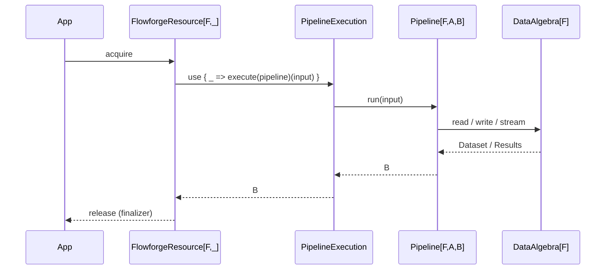

# Core Design: Effects, Resources, and Pipelines

This document explains why FlowForge’s Core is strictly effect‑agnostic, what the minimal `EffectSystem[F]` provides, how `FlowforgeResource[F, R]` fits in, and how these map to common libraries (Cats‑Effect IO and ZIO Task).

## Why a minimal EffectSystem

Goals
- Interchangeability: Users bring their own F without rewriting FlowForge.
- Portability: Core compiles with no hard dependency on any effect runtime.
- Predictability: One place (type class) centralizes async, concurrency, timing, and resource safety.

Scope (grouped by concern)
- Core monad ops: `pure`, `map`, `flatMap`, `raiseError`, `handleErrorWith`.
- Async: `async`, `fromFuture`.
- Concurrency: `start`, `race`, `racePair`.
- Parallelism: `parTraverse`, `parSequence`, `parProduct`.
- Timing: `sleep`, `timeout`.
- Resource safety: `bracket`, `bracketCase`.

Trade‑offs
- Minimal surface avoids over‑constraining users and keeps the typeclass implementable on diverse runtimes.
- Advanced features (e.g., structured scopes) stay outside of Core; adapters are provided in infrastructure.

## Why FlowforgeResource in Core

- Effect‑neutral resource safety. Many runtimes offer their own resource type; Core exposes a small façade:
  - `FlowforgeResource.make(acquire)(release)` implemented via `EffectSystem[F].bracket`.
  - `FlowforgeResource.pure(value)` for in‑memory resources.
- Keeps all public Core APIs free of runtime‑specific resource types while guaranteeing proper cleanup.

## Mapping to common libraries

| Capability           | EffectSystem[F]         | Cats‑Effect IO                     | ZIO Task                     |
|----------------------|-------------------------|------------------------------------|------------------------------|
| Pure / Map / FlatMap | `pure/map/flatMap`      | `IO.pure/map/flatMap`              | `ZIO.succeed/map/flatMap`    |
| Errors               | `raiseError/handle…`    | `IO.raiseError/handleErrorWith`    | `ZIO.fail/catchAll`          |
| Async                | `async/fromFuture`      | `IO.async/IO.fromFuture`           | `ZIO.async/ZIO.fromFuture`   |
| Fibers               | `start/join/cancel`     | `fa.start` → `Fiber.join/cancel`   | `fa.fork` → `Fiber.join/interrupt` |
| Races                | `race/racePair`         | `IO.race/IO.racePair`              | `raceEither/raceWith`        |
| Parallelism          | `parTraverse/parSeq`    | `list.parTraverse / parSequence`   | `ZIO.foreachPar / collectAllPar` |
| Timing               | `sleep/timeout`         | `IO.sleep/IO#timeout`              | `ZIO.sleep/timeoutFail`      |
| Resources            | `bracket/bracketCase`   | `bracket/bracketCase`              | `acquireReleaseWith`         |

Notes
- FlowforgeResource composes with any EffectSystem implementation and can be adapted from cats.Resource or ZIO acquire/release (see adapters in `modules/infrastructure`).

## Architecture (high level)

```mermaid
flowchart TD
  A[User Code / App] -->|builds| B[PipelineBuilder (Core)]
  B -->|builds Kleisli| C[Pipeline (Core)]
  C -->|executes| D[DataAlgebra (Core)]
  D --> E[Engine: Spark/Flink]
  D --> F[Connectors: S3/GCS/JDBC/Kafka]
  C --> G[Quality: Native/Deequ]
  C --> H[Lineage: OpenLineage]
  E --> I[(External Systems)]
  F --> I
```

## Pipeline execution (sequence)



## Core relationships (class diagram)

```mermaid
classDiagram
  class EffectSystem~F~{
    +pure[A](a)
    +map/flatMap
    +raiseError/handleErrorWith
    +async/fromFuture
    +start/race/racePair
    +parTraverse/parSequence
    +sleep/timeout
    +bracket/bracketCase
  }
  class FlowforgeResource~F,R~{
    +use[B](R => F[B]): F[B]
    +make(acquire)(release)
  }
  class DataAlgebra~F~{
    +read[A]
    +write[A]
    +stream[A]
  }
  class PipelineBuilder~F~
  class Pipeline~F,A,B~
  EffectSystem <|.. (instances)
  FlowforgeResource --> EffectSystem : uses bracket
  PipelineBuilder --> Pipeline
  Pipeline --> DataAlgebra
```

## Builder flow (typestate)

```mermaid
flowchart LR
  S[Empty] -->|addTypedSource| ST[Source+Contract]
  ST -->|addTransform| STT[+Transform]
  STT -->|addTypedSink| C[Complete]
  C -->|build| P[Pipeline[F, In, Out]]
```

## Examples
- BYO‑F snippets: `docs/examples/byo-effect-examples.md`
- Template apps: `PipelineApp` (IO) and `ZioPipelineApp` (ZIO) in `flowforge.g8`.

---
If you need a new effect runtime, implement `EffectSystem[F]` once and use `FlowforgeResource` for resources. Everything else is library code.

