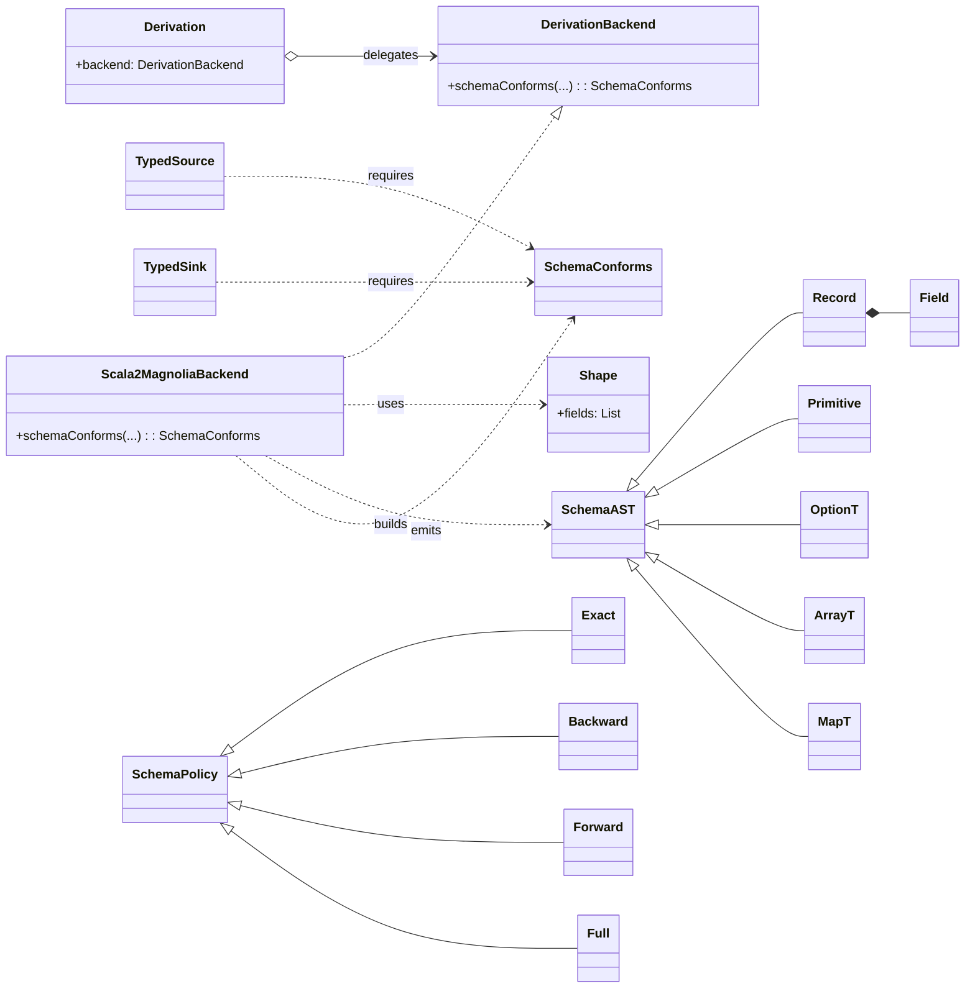

# UML - Scala 2 (Magnolia)

Notes

- Backend materializes `Shape[T]` and computes a normalized `SchemaAST`.
- `SchemaConforms` is synthesized if `SchemaAST(Out)` conforms to `SchemaAST(Contract)` under a `SchemaPolicy`. Otherwise, the macro aborts with a human-readable diff.
- Public typed edges (`TypedSource`, `TypedSink`) only depend on typeclass evidence.

Glossary

- Shape: compile-time structural description of a case class (field names/types, optional/default).
- SchemaAST: normalized tree built from Shape or reflection (Record, Field, Primitive, Option, Array, Map).
- SchemaConforms: typeclass “Out conforms to Contract under Policy P”.
- Policy: Exact / Backward / Forward / … define evolution rules.

Design patterns used

- Strategy/Bridge: Derivation facade (Scala 2 backend here, Scala 3 later) decouples callers from implementation.
- Typeclass: SchemaConforms is a typeclass provided by the macro.
- ADTs: Policy and SchemaAST are modeled as sealed hierarchies.
- SOLID: Single Responsibility (macro verifies structure only), Open/Closed (add new policies without changing caller code), Dependency Inversion (callers depend on SchemaConforms abstraction).
