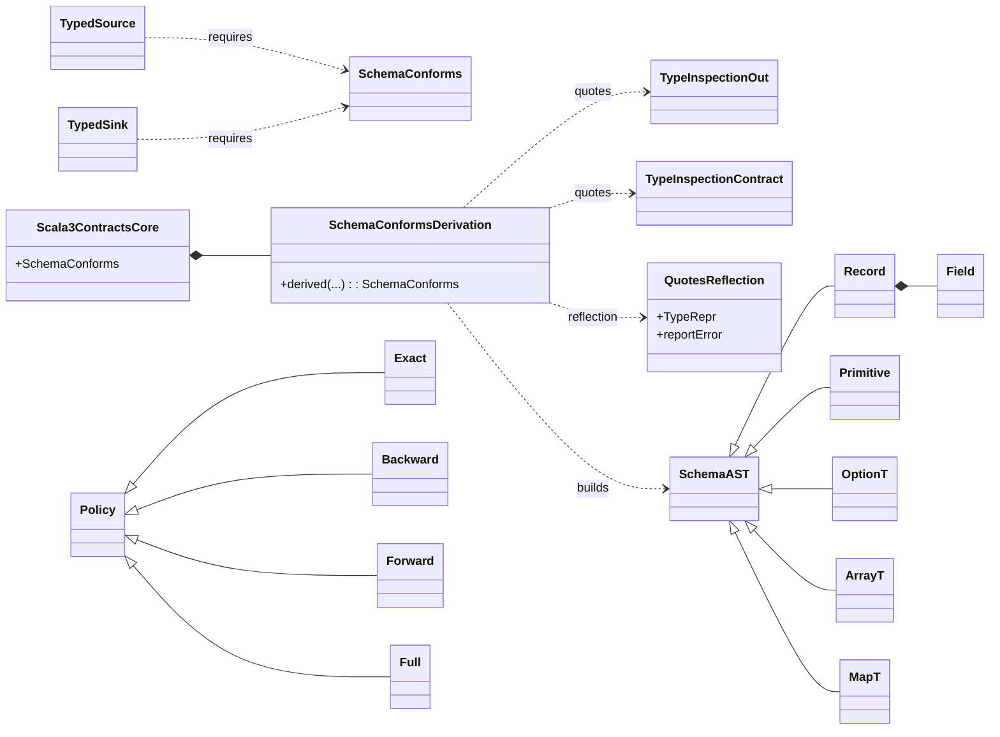

# UML - Scala 3 (Quotes Macros; Mirrors optional)

Notes

- Inline derivation computes both shapes via Quotes reflection (or Mirrors) and compares under selected policy.
- On mismatch, the macro aborts with a path-aware diff.
- The public surface mirrors Scala 2 so the rest of the platform is backend-agnostic.

Glossary

- Quotes/TypeRepr: Scala 3’s macro reflection API to inspect types at compile time.
- Mirrors (optional): product/sum descriptors; can be used instead of quotes traversal.
- SchemaConforms/Evidence: see Scala 2 UML notes - identical concept, different backend.

Design patterns used

- Strategy/Bridge: same Derivation facade, different backend (Quotes macro; Mirrors optional).
- Typeclass + ADTs: unchanged; we still produce SchemaConforms based on SchemaAST.
- SOLID: same reasoning as Scala 2 - verification is isolated and declarative.
