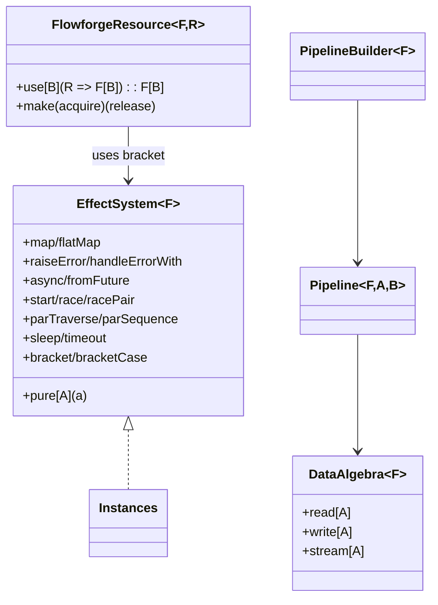

# Core Class Diagram (Mermaid)

```mermaid
classDiagram
  class EffectSystem~F~{
    +pure[A](a)
    +map/flatMap
    +raiseError/handleErrorWith
    +async/fromFuture
    +start/race/racePair
    +parTraverse/parSequence
    +sleep/timeout
    +bracket/bracketCase
  }
  class FlowforgeResource~F,R~{
    +use[B](R => F[B]): F[B]
    +make(acquire)(release)
  }
  class DataAlgebra~F~{
    +read[A]
    +write[A]
    +stream[A]
  }
  class PipelineBuilder~F~
  class Pipeline~F,A,B~
  EffectSystem <|.. Instances
  FlowforgeResource --> EffectSystem : uses bracket
  PipelineBuilder --> Pipeline
  Pipeline --> DataAlgebra
```
