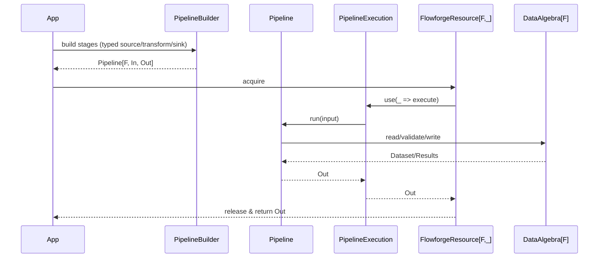

# Pipeline Execution Sequence (Mermaid)

```mermaid
sequenceDiagram
  participant App
  participant PB as PipelineBuilder
  participant P as Pipeline
  participant Exec as PipelineExecution
  participant FR as FlowforgeResource[F,_]
  participant DA as DataAlgebra[F]

  App->>PB: build stages (typed source/transform/sink)
  PB-->>App: Pipeline[F, In, Out]
  App->>FR: acquire
  FR->>Exec: use(_ => execute)
  Exec->>P: run(input)
  P->>DA: read/validate/write
  DA-->>P: Dataset/Results
  P-->>Exec: Out
  Exec-->>FR: Out
  FR-->>App: release & return Out
```
