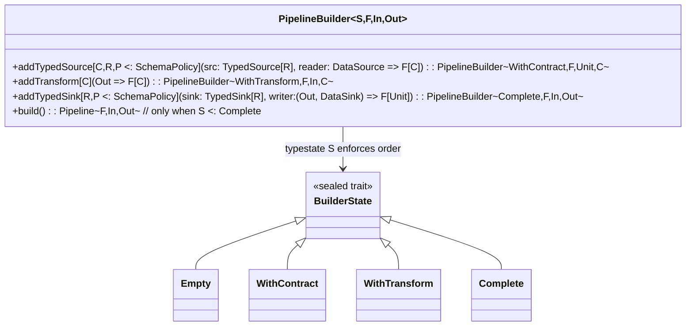
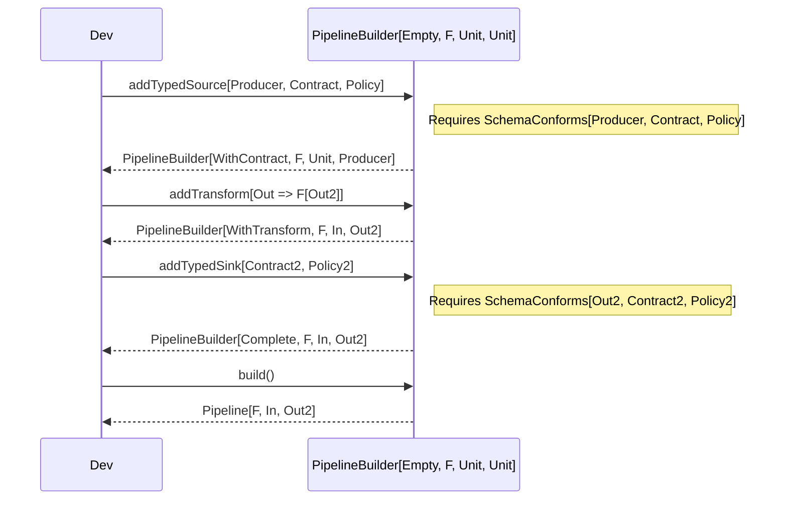

# Typestate & Contracts (Mermaid + Code Pointers)

This diagram shows how compile‑time builder typestate and `SchemaConforms` evidence enforce correctness.

Code pointers
- addTypedSource requires `SchemaConforms[C, R, P]` evidence at compile time.
  - File: modules/core/src/main/scala/com/flowforge/core/PipelineBuilder.scala
- addTransform requires previous state `S <:< WithContract`.
- addTypedSink requires previous state `S <:< WithTransform` and `SchemaConforms[Out, R, P]`.
- build requires `S <:< Complete`.

Sequence of a valid build

This guarantees pipelines “will not even build” if contracts or stage order are incorrect.

