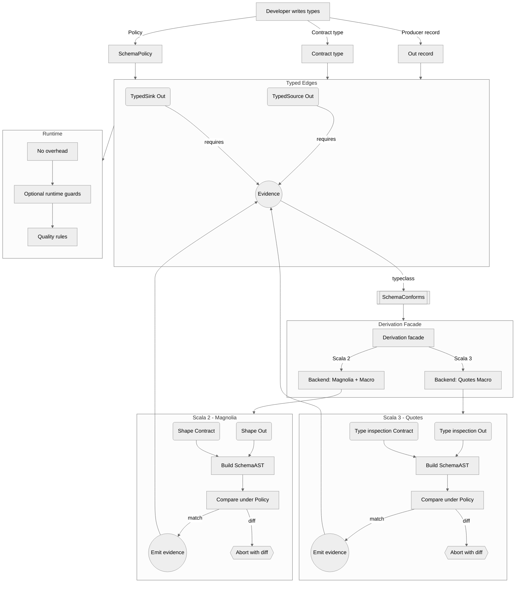

# Archived - 2) Talk: Review + Improvements + Revised Deck (brand-agnostic)

> This file is archived. See the new concept‑only decks:
> - docs/talks/talk-a-api-migration.md
> - docs/talks/talk-b-types-validation.md

**Scope reviewed:** `docs/talks/ScalaIO-2025-Compile-Time-Contracts-Fiber-Safe-Pipelines.md` (brand-agnostic), plus ScalaIO event blurb doc. The structure is strong: narrative pain → compile-time contracts → typestate builder → effect boundaries → engines → DQ → DX. Below are improvements and a consolidated, revised deck.

## Targeted improvements (as tasks)

- Tighten the **problem framing** with one concrete failure mode (schema drift) and one **compile-time** before/after slide (red→green).
- Add a **policy lattice mini-table** to make “Exact/Backward/Forward × Ordered/CI” immediately visual.
- Show the **typestate builder** in 6 lines: “what compiles / what fails” with a missing sink.
- Clarify **why a minimal EffectSystem** (not a wrapper over Cats/ZIO); show the exact surface area and the interop point.
- One **pure vs effectful** split slide with side-by-side code: left `Dataset.map`, right `read/write F[_]`.
- Add **engine swap** demo (Spark callsite vs Flink stub) to prove trait swap.
- Keep **DQ** to one slide; emphasize optional Deequ via reflection, default native checks.
- End with a **checklist** audiences can take home: Contracts first, Typestate builder, Algebra split, Minimal effect abstraction, Compile-fail tests.
- Include **live “red→green” moment** (policy: Exact → Backward).
- Add **FAQ slide** answers inline (policy order, CI, evolution safety, fibers across IO/ZIO, unit testing strategy).

## Why-First Addendum (2025-10-02)

- The Why, in 20 seconds:
  - Runtime schema drift burns nights and weekends. If we move that failure to compile time, we protect trading hours and engineers’ sleep.
  - Side-effects (audit/Slack) inside Spark transforms amplify retries and speculation → duplicates, rate limits, and untraceable incidents. We put all effects at the edges and make them idempotent.
- A Story (real‑world):
  - “A partner team rolled out a late‑night change that removed a nullable column. Our on‑call couldn’t roll back in time; both teams were up all night before trading opened. If that mismatch were a compile error, we would have slept.”
- Clear boundary:
  - Compile‑time: structural compatibility of types vs contracts (policy lattice), builder typestate (no incomplete pipelines).
  - Runtime: real files/streams can still be corrupt or empty → optional DQ guards, lineage, and metrics.
- DX vs Process:
  - DX is fast red→green loops (template + compile‑fail tests). Process is CI gates: policy matrix + example diffs in PRs.


## Revised talk (brand-agnostic Markdown deck)

### Slide 1 - The Premise (2 min)
- What if broken pipelines never launched-because the **compiler** stopped them?
- What if orchestration **respected fibers**, and Spark transforms stayed **pure**?
- Today: a design blueprint for **type-first, effect-aware** data engineering in Scala.

### Slide 1.0b - Why you should care (1 min)
- You lose the most hours to: schema drift discovered at runtime; non‑idempotent edge effects; inability to roll back safely.
- This design turns those into build‑time failures and edge‑only effects with idempotency.

> *Speaker note:* Start with a 30-second “we shipped junk on Friday because a field was added silently.” Then: “let’s move that pain left-into the compiler.”

---

### Slide 1.1 - Code Smell: a fragile Spark job (live pain) (3 min)
```scala
import org.apache.spark.sql._
import org.apache.spark.sql.functions._

// Naive (fragile) event logging around a batch
// Spark writes data to cloud storage; AUDIT + NOTIFY are external side‑effects
trait AuditDb { def insert(event: String, batchId: String, meta: Map[String,String] = Map.empty): Unit }
trait Notifier { def post(channel: String, text: String): Unit }

object BadJobEventsOnly {
  def run(spark: SparkSession, audit: AuditDb, notify: Notifier, from: String, to: String): Unit = {
    import spark.implicits._

    val batchId = s"${from}_to_${to}" // e.g., 2018‑01‑01_to_2018‑06‑30

    audit.insert("START", batchId, Map("at" -> java.time.Instant.now.toString))

    val users = spark.read
      .option("header", "true").option("inferSchema", "true") // ❌ prod‑unfriendly
      .csv(s"s3://raw/users/*_$from_$to.csv")

    // DQ on source (action) - triggers a job
    val badEmails = users.filter(!$"email".contains("@")).count() // ACTION
    audit.insert("DQ_SOURCE", batchId, Map("badEmails" -> badEmails.toString)) // ❌ not idempotent

    // Pure transforms (fine) - but we log DAG/plan to Slack (side‑effect)
    val cleaned = users.withColumn("email", lower(col("email"))).withColumn("flag", lit(1))
    val plan = cleaned.queryExecution.executedPlan.toString() // can be large
    notify.post("#ops", s"Plan for $batchId:\n$plan") // ❌ may breach rate limits / size caps

    // Pre‑sink DQ (another action) - may re‑compute lineage if not cached
    val rows = cleaned.count() // ACTION (re‑exec if not cached/persisted)
    audit.insert("DQ_PRESINK", batchId, Map("rows" -> rows.toString)) // ❌ duplicates on retry

    // Actual sink - write to cloud (OK)
    cleaned.write.mode("append").parquet(s"s3://curated/users/$from-$to/")

    // End status (yet another side‑effect)
    audit.insert("END", batchId, Map("durationMs" -> "...")) // ❌ duplicate if job restarts here
    notify.post("#ops", s"Batch $batchId finished") // ❌ duplicate if speculative/retry
  }
}
```

**What hurts here (and why it hurts)**
- *At‑least‑once execution*: retries & speculative execution can re‑run work; side‑effects (Audit/Slack) repeat unless **idempotent**.
- *Lazy evaluation & multiple actions*: each `count()` (DQ) is an **action** that can **recompute** prior transforms if not cached; logging around actions can log **multiple times** on re‑exec.
- *Event log volume/rate limits*: dumping full physical plans to Slack can breach **rate limits** and payload caps; throttle and respect `Retry‑After`.
- *Non‑idempotent audit schema*: `insert` without a **unique key** (`batchId` + `phase`) yields **duplicates** on retries/restarts. Use upsert/merge semantics.

**Transition line (to the solution slides)**
- We’ll fix this with **idempotent audit/notify**, **pure transforms**, caching where appropriate, and **fiber‑safe orchestration** (bracketed resources, backoff, throttling).

### Slide 1.1b - Why side‑effects blow up (6‑month batches over 4 years) (2 min)
**Scenario**: For each 6‑month batch you **log to an Audit DB** and **POST a Slack notification**.

**What can go wrong (and why)**
- **Task retries & speculative execution** → the *same batch step* may run more than once → **duplicate audit rows / duplicate Slack posts** unless idempotent.
- **Lazy re‑evaluation** → side‑effects inside transforms can be executed **multiple times** or in **unexpected order** when actions trigger execution.
- **Non‑idempotent sinks** → `foreach`/custom sinks can partially succeed then be **replayed** on retry; implement **upsert/MERGE** keyed by `batch_id` (and natural keys).
- **Connection storms** → per‑row/per‑task DB inserts overwhelm the audit DB. Use `foreachPartition` + **batching**/**pooling**.
- **HTTP rate limits** (Slack & others) → parallel executors can flood APIs → **429 Too Many Requests**; respect `Retry‑After`, backoff & jitter, or serialize through a queue.

**Mitigations you’ll see later in this deck**
- Treat side‑effects as **at‑least‑once**; design **idempotent** effects using `batch_id` + keys.
- Keep transforms **pure**; do effects in **edge blocks** (e.g., `foreachBatch` / `foreachPartition`), with **bracketed** resources and **bounded concurrency**.
- Centralize notifications (driver/queue) or apply **per‑channel throttling** + **exponential backoff**.

### Slide 1.2 - Same job, sane patterns (brand‑agnostic) (3 min)
```scala
import org.apache.spark.sql._
import org.apache.spark.sql.functions._
import org.apache.spark.sql.types._

// Event‑level side effects - idempotent by (batchId, phase)
trait AuditDb { def upsert(phase: String, batchId: String, meta: Map[String,String] = Map.empty): Unit }
trait Notifier { def notifyOnce(key: String, text: String): Unit }

object GoodJobEventsOnly {
  def run(spark: SparkSession, audit: AuditDb, notify: Notifier, from: String, to: String): Unit = {
    import spark.implicits._
    val batchId = s"${from}_to_${to}" // deterministic 6‑month window

    def phase(name: String)(f: => Unit): Unit = { audit.upsert(name + ":START", batchId); try f finally () }

    // Explicit schema + (ideally) compile‑time contract
    val userSchema = StructType(Seq(
      StructField("id", LongType, nullable = false),
      StructField("email", StringType, nullable = false)
    ))
    val users = spark.read.schema(userSchema).csv(s"s3://raw/users/*_$from_$to.csv")

    // Source DQ - single action, result cached for reuse
    phase("DQ_SOURCE") {
      val usersCached = users.persist()
      val bad = usersCached.filter(!$"email".contains("@")).count() // ACTION
      audit.upsert("DQ_SOURCE:RESULT", batchId, Map("badEmails" -> bad.toString))

      // Pure transforms
      val cleaned = usersCached
        .withColumn("email", lower(col("email")))
        .withColumn("flag",  lit(1))

      // Optional: compact DAG summary instead of full plan
      val nodes = cleaned.queryExecution.optimizedPlan.stats.sizeInBytes.toString
      notify.notifyOnce(s"plan.$batchId", s"Batch $batchId plan size≈$nodes bytes")

      // Pre‑sink DQ - reuse cached lineage to avoid re‑exec
      val rows = cleaned.count() // ACTION
      audit.upsert("DQ_PRESINK:RESULT", batchId, Map("rows" -> rows.toString))

      // Cloud sink (parquet)
      cleaned.write.mode("append").parquet(s"s3://curated/users/$from-$to/")
    }

    // Final status + idempotent notification
    audit.upsert("END", batchId, Map("at" -> java.time.Instant.now.toString))
    notify.notifyOnce(s"done.$batchId", s"Users batch $batchId processed ✔")
  }
}
```

**Why this holds up under failure**
- **Idempotent phases**: `upsert((batchId, phase))` avoids duplicates across retries/restarts; treat effects as **at‑least‑once**.
- **Minimized actions & caching**: compute DQ once and **reuse** lineage; fewer opportunities for re‑execution and duplicate logs.
- **Rate‑limited notifications**: `notifyOnce(key, …)` enforces **one post per batch** and can honor Slack’s `Retry‑After`.

### Slide 2 - Agenda (1 min)
- Pain → Promise
- Contracts & policies (compile gates)
- Typestate builder (unbuildable invalid pipelines)
- Effects & fibers (minimal, portable)
- Engine boundary (Spark) and portability (Flink)
- DX: templates, compile-fail tests, DQ
- Recommendations + FAQ

---

### Slide 3 - The Pain We Normalized (3 min)
- **Schema drift** discovered late → dashboards red, weekend hotfixes
- **Side-effects** leaking into transforms (JDBC, HTTP) → flaky tests
- Orchestrators **schedule**, they don’t **enforce purity**
- Spark jobs mix IO with logic → slow, brittle tests

---

### Interlude - Data Contracts 101 (why contracts before code)
**Slide (what the audience sees)**
- A **data contract** is a **promise** from producer to consumer.
- It captures **schema + meaning + freshness + ownership**.
- **Policies** define compatible change: *Exact*, *Backward*, *Forward*.

*Speaker notes (you say this, not on slide):* Contracts turn “tribal knowledge” into types and checks. A contract answers: *what fields exist, what they mean, how often data lands, who owns it*. Policies are the rules for safe evolution (e.g., add-only is Backward). We’ll use these to make the compiler reject unsafe pipelines.

---

### Slide 4 - Contracts & Policies (5 min)
```scala
// Compile-time policy gate
final case class Consumer(id: Long, email: String)
final case class Producer(id: Long, email: String, age: Int)

// Exact: must match fields exactly  → should FAIL
implicitly[SchemaConforms[Producer, Consumer, SchemaPolicy.Exact]] // ❌ compile error

// Backward: producer may add fields, consumer tolerates missing → OK
implicitly[SchemaConforms[Producer, Consumer, SchemaPolicy.Backward]] // ✅ compiles
```

**Policy lattice (mental model):**

| Policy            | Extra producer fields | Missing producer fields | Order sensitive | Case insensitive |
|-------------------|-----------------------|-------------------------|-----------------|------------------|
| Exact             | ❌                     | ❌                       | Opt             | Opt              |
| Backward          | ✅ (optional/default)  | ❌                       | Opt             | Opt              |
| Forward           | ❌                     | ✅ (consumer tolerant)   | Opt             | Opt              |

> *Speaker note:* We derive shapes (Magnolia), build ASTs, compare per policy in a macro. If the instance can’t be derived, the compiler aborts with field-level diffs.

---

### Interlude - `inline` & Macros: the 1‑minute mental model
**Slide (what the audience sees)**
- `inline` → **expand code at compile time**.
- Macros → **generate/inspect code at compile time**.
- Use them to **enforce rules before runtime**.

*Speaker notes (you say this, not on slide):*
- **`inline`**: the compiler **replaces the call with the method body** at the call site. `transparent inline` can improve inferred types.
- **Macros**: **compile‑time code** that can **inspect/generate** well‑typed Scala (quotes/splices under the hood).
- **Why we care**: we derive **type shapes** and materialize `SchemaConforms[Out, Contract, Policy]`. If not compatible, we **abort compilation** with a readable diff - the “red” moment.

_Pseudo‑code (illustrative only):_
```scala
import scala.compiletime.error

inline def conforms[Out, Contract, Policy]: Unit =
  inline if compatible(shape[Out], shape[Contract], summon[Policy]) then ()
  else error("Schema mismatch: Producer has extra field 'age: Int' not present in Consumer")
```


### Slide 5 - “How It Works” (3 min)
- `Shape[T]` (Magnolia) → `SchemaAST`
- Macro compares `AST(Out)` vs `AST(Contract)` under a chosen policy
- `SchemaConforms[Out, Contract, Policy]` **exists or compilation aborts**
- Drift becomes a **compile error**, not a pager

#### Mermaid flowchart



*Speaker notes - detailed walkthrough of the flowchart:*

1) **Authoring (A → A1/A2/A3).**  
   The developer writes three things:
   - **Out record (A1)** - the Scala type produced by your transforms (e.g., `UserOut`).  
   - **Contract type (A2)** - the schema the consumer expects (e.g., `UserContract`).  
   - **Policy (A3)** - *how* to compare shapes (Exact/Backward/Forward + flags like order/case sensitivity).  
   These are just plain types/constants; nothing runs yet.

2) **Typed edges demand evidence (B → E).**  
   When you call `addTypedSource[...]` or `addTypedSink[...]`, the method signature requires an *implicit* proof:  
   `SchemaConforms[Out, Contract, Policy]`.  
   Think of it as a **phantom “OK” token** the compiler must be able to produce. If it can’t, the call site fails to compile.

3) **Implicit search triggers derivation (E → D1 → C).**  
   The compiler looks for a `given/implicit` instance of `SchemaConforms[Out, Contract, Policy]`.  
   - It first tries the **Derivation Facade (C0)** in `C` which hides backend specifics.  
   - That facade delegates to the **Scala 2 backend** (Magnolia + macro) or the **Scala 3 backend** (Quotes macro), depending on the build.  
   The goal in both cases is the same: **compute shapes → compare → either materialize evidence or abort**.

4) **Build normalized shapes (S2/S3: M1+M2 or G1+G2 → M/G3).**  
   Each backend inspects the structure of `Out` and `Contract` and builds a **SchemaAST**: a normalized tree of fields (names, types, optionality/nullability, nesting, and-subject to flags-order/case normalization).  
   - Products (case classes) and nested products are supported; sealed trait hierarchies can be handled if allowed by your policy.  
   - Custom field-level knobs (e.g., ignore/rename) can be encoded as annotations, if enabled.

5) **Policy-aware comparison (M/G4).**  
   The ASTs are compared under the selected policy:  
   - **Exact**: same fields and types (and order if required). No extras either side.  
   - **Backward**: producer may **add** fields; common fields must remain compatible; **missing** required consumer fields is an error.  
   - **Forward**: consumer tolerates **missing** producer fields; extra fields are not allowed; types must remain compatible.  
   Case sensitivity and order checks are toggled by the policy’s flags.

6) **Emit proof or abort (M/G5 vs M/G6 & G/G6).**  
   - If compatible, the macro **materializes** a tiny instance of `SchemaConforms[...]` - this is the **E** token. It’s a **compile‑time value only**.  
   - If not, the macro **aborts compilation** with a **human‑readable diff**: lists of missing/extra fields and type mismatches, annotated with the active policy and flags.  
   This is your *“red”* moment in the live demo.

7) **Typed edges are now safe (B using E).**  
   With evidence in scope, `addTypedSource/…Sink` type‑check. The builder progresses toward `Complete`.  
   Because the proof is **erased at runtime**, there’s **no runtime overhead**. The safety net existed only at compile time.

8) **Runtime layer (R): zero‑overhead + optional guards.**  
   At runtime, you just have **pure transforms** and **edge effects**. If you choose, you can enable **runtime guards** (e.g., lightweight DQ or schema fingerprints) that complement compile‑time checks by validating actual files/streams. These aggregate with `ValidatedNel` (multi‑error) and don’t change the compile‑time story.

9) **Cross‑version story (C1/C2 → S2/S3).**  
   - **Scala 2 path (S2)** uses Magnolia to derive structural “Shape” information, then a macro to compare ASTs and **abort or emit**.  
   - **Scala 3 path (S3)** uses Quotes + Mirrors to inspect types and perform the same check.  
   The **Derivation Facade** ensures call sites and error messages stay consistent across Scala versions.

10) **Why this design works.**  
    - **Push correctness left**: schema drift becomes a compiler error.  
    - **Keep transforms pure**: only the typed edges request evidence; business logic stays engine‑agnostic.  
    - **Great DX**: compile‑fail tests can pin the exact error text; the policy lattice is explicit; failure is actionable.

11) **Common edge cases to call out (if asked).**  
    - `Option` vs required fields (nullability), numeric widenings, field renames/aliases, sealed traits, and nested types.  
    - Order/case toggles and “ignored fields” annotations.  
    - Performance: derivation is cached per type; compile‑time cost scales with the number of fields; runtime cost is zero.

12) **Narrate the live flow (recap).**  
    You type `addTypedSource[Producer, Consumer, Backward](…)` → implicit search runs → the facade builds ASTs → policy comparison → either **green** (proof materialized) or **red** (diff + compile abort). Then you finish the builder and run; optional runtime DQ emits structured errors without affecting the compile‑time guarantee.

---

### Interlude - Phantom Types (compile-safe builder)
**Slide (what the audience sees)**
- **Compile-safe builder**: `.build` is available only when required fields exist.
- **Phantom types** = stickers for the compiler; **zero runtime cost**.
- **Invalid states are unrepresentable**.

*Speaker notes:* We encode the builder’s state at the type level (missing/present fields). Each setter flips a type flag; `.build` requires proofs that *all* flags are present. Inspired by Xebia’s “compile-safe builder” pattern.

```scala
// Inspired by a compile-safe builder pattern (phantom types)
sealed trait Missing; sealed trait Present
final case class Person(first: String, last: String, email: String)

final class PersonBuilder[F, L, E] private (
  first: Option[String],
  last:  Option[String],
  email: Option[String]
) {
  def withFirst(s: String)(implicit ev: F =:= Missing): PersonBuilder[Present, L, E] =
    new PersonBuilder[Present, L, E](Some(s), last, email)

  def withLast(s: String)(implicit ev: L =:= Missing): PersonBuilder[F, Present, E] =
    new PersonBuilder[F, Present, E](first, Some(s), email)

  def withEmail(s: String)(implicit ev: E =:= Missing): PersonBuilder[F, L, Present] =
    new PersonBuilder[F, L, Present](first, last, Some(s))

  // Only callable when ALL fields are Present (compile-time evidence)
  def build(implicit
    evF: F =:= Present,
    evL: L =:= Present,
    evE: E =:= Present
  ): Person =
    Person(first.get, last.get, email.get)
}

object PersonBuilder {
  type Start = PersonBuilder[Missing, Missing, Missing]
  def apply(): Start = new PersonBuilder(None, None, None)
}

// ✅ Compiles: all required fields present
val ok =
  PersonBuilder()
    .withFirst("Ada")
    .withLast("Lovelace")
    .withEmail("ada@analytical.engine")
    .build

// ❌ Won’t compile: missing first/last (build requires all flags = Present)
// val nope = PersonBuilder().withEmail("bad@domain").build
```

### Slide 6 - The Typestate Builder (3 min)
```scala
// Invalid pipelines are unrepresentable
PipelineBuilder[Start, F, Unit, Unit]("users")
  // .addTypedSink(...) // missing
  .build                          // ❌ doesn't compile: not Complete

PipelineBuilder[Start, F, Unit, Unit]("users")
  .addTypedSource[Producer, Consumer, SchemaPolicy.Backward](src, read)
  .addTransform(_.copy(...))
  .addTypedSink[Consumer, SchemaPolicy.Exact](sink, write)
  .build                          // ✅ compiles: Complete
```
> *Speaker note:* Phantom states (`WithContract`, `WithTransform`, `Complete`) plus `build` requiring `Complete`. The compiler enforces the sequence.

---

### Interlude - Kleisli (pipelines as `A => F[B]`)
**Slide (what the audience sees)**
- A Kleisli is a **named step**: “give me an `A`, I’ll do work in a box `F` and return `B`”.
- Steps **click together** (compose) like an **assembly line**.
- Avoids nested `flatMap`s; pipelines read **left → right**.

*Speaker notes:* Formally `Kleisli[F, A, B]` wraps `A => F[B]`. Composition gives you clean, linear pipelines when each step returns an effect (IO/ZIO/Task/…).

_Tiny sketch:_
```scala
import cats.data.Kleisli

val read:      Kleisli[F, Unit, Data]  = Kleisli(_ => fetch: F[Data])
val transform: Kleisli[F, Data, Data]  = Kleisli(d => pureTransform(d).pure[F])
val write:     Kleisli[F, Data, Unit]  = Kleisli(d => persist(d))

val pipeline: Kleisli[F, Unit, Unit] = read andThen transform andThen write
pipeline.run(()) // do the thing
```

### Slide 7 - Orchestration as Kleisli (3 min)
- Pipelines compose as `Kleisli[F, In, Out]`
- We get lawful composition, easy substitution, and **no hidden IO** in transforms
- Concurrency is explicit (fibers/parallel) via the effect abstraction

```scala
import cats.data.Kleisli
import cats.effect.IO
import com.flowforge.core.PipelineBuilder
import com.flowforge.core.contracts.SchemaPolicy
import com.flowforge.core.instances.EffectInstances.catsEffectSystemInstance
import com.flowforge.core.types._
import com.flowforge.core.types.TypedIO._

// Domain models (producer vs consumer)
final case class Producer(id: Long, email: String, age: Int)
final case class Consumer(id: Long, email: String)

// Typed endpoints (require Shape evidence via TypedIO)
val src: TypedSource[Consumer] = localParquetSource[Consumer]("s3://raw/users.parquet")
val sink: TypedSink[Consumer]   = localParquetSink[Consumer]("s3://curated/users.parquet")

// Build a tiny pipeline via PipelineBuilder (phantom-typed; compile-time contracts)
val pipeline =
  PipelineBuilder[IO]("users-clean")
    .addTypedSource[Producer, Consumer, SchemaPolicy.Backward](
      src,
      _ => IO.pure(Producer(1L, "ADA@EXAMPLE.ORG", 28)) // sample source
    )
    .addTransform[Consumer](p => IO.pure(Consumer(p.id, p.email.toLowerCase)))
    .addTypedSink[Consumer, SchemaPolicy.Exact](
      sink,
      (_: Consumer, _: DataSink) => IO.unit
    )
    .build()

val k: Kleisli[IO, Unit, Unit] = pipeline.run // Kleisli: the built pipeline executes as Kleisli[F, In, Out]
```

---

### Slide 8 - Minimal Effect System (3 min)
```scala
trait EffectSystem[F[_]] extends MonadError[F, Throwable] {
  trait Fiber[F[_], A] { def cancel: F[Unit]; def join: F[A] }
  def start[A](fa: F[A]): F[Fiber[F, A]]
  def parTraverse[A,B](as: List[A])(f: A => F[B]): F[List[B]]
  def bracket[A,B](acq: F[A])(use: A => F[B])(rel: A => F[Unit]): F[B]
  def timeout[A](fa: F[A], d: FiniteDuration): F[A]
  // ... async/fromFuture/map/flatMap/handleErrorWith
}
```
- Implementations for **IO** and **ZIO Task**; enough to **bracket** resources, run **fibers**, and **parallelize** safely
- Not a new effect framework-just the thin bridge we need

### Slide 8.1 - Fiber‑safe Data Pipelines (2 min)
**Slide (what the audience sees)**
- Keep **Spark transforms pure**; push **side‑effects** (audit/log/IO) to the edges.
- Use **fibers** for parallel IO; **bracket** to guarantee cleanup.
- Result: predictable tests, safe cancellation, no orphan work.

*Speaker notes:* We orchestrate IO (reads/writes/audits) in `F[_]` and keep transforms as **pure Dataset ops**. Fibers run IO in parallel and cancel cleanly; `bracket` guarantees resources (e.g., JDBC/HTTP audit clients) are closed even on failure or timeout.

_Realistic sketch (algebra + effect; transforms stay pure):_
```scala
// Minimal audit capability at the edge (effectful)
trait Audit[F[_]] {
  def log(e: AuditEvent): F[Unit]
  def close: F[Unit]
}
sealed trait AuditEvent
object AuditEvent {
  final case class Start(id: String) extends AuditEvent
  final case class Info(msg: String) extends AuditEvent
  final case class Success(msg: String) extends AuditEvent
  final case class Failure(msg: String, cause: Throwable) extends AuditEvent
}

// Job wired against abstract algebra + effect system
def runJob[F[_]](
  alg: DataAlgebra[F],
  F:   EffectSystem[F],
  mkAudit: F[Audit[F]]
): F[Unit] = {

  import F._ // start/join/bracket/timeout/...

  // Resource safety: open audit client, always close it
  bracket(mkAudit) { audit =>
    for {
      _      <- audit.log(AuditEvent.Start("users-spend-v1"))
      // Parallelize IO reads (fibers)
      fu     <- start(alg.read[User](DataSource.gcs("gs://data/users.parquet")))
      ft     <- start(alg.read[Txn](DataSource.gcs("gs://data/txns.parquet")))
      users  <- fu.join
      txns   <- ft.join

      // ---------- PURE TRANSFORMS (no F here) ----------
      // join/map/etc. are pure facades over the engine
      joined  = alg.join(users, txns, (_.id), (_.userId),
                         (u, t) => UserWithSpend(u.id, u.email, t.amount))
      cleaned = alg.map(joined, u => u.copy(email = u.email.toLowerCase))
      // --------------------------------------------------

      _      <- audit.log(AuditEvent.Info("prepared dataset; writing..."))
      _      <- alg.write(cleaned, DataSink.jdbc("jdbc:postgresql://.../dw", "user_spend"))
      _      <- audit.log(AuditEvent.Success("write complete"))
    } yield ()
  }(audit => audit.close)
}

// Optional: apply timeouts/cancellation at the orchestration boundary
def runWithTimeout[F[_]](
  job: F[Unit],
  F: EffectSystem[F]
): F[Unit] =
  F.timeout(job, 30.seconds) // cancels fibers and runs finalizers
```

_Talking points to call out as you scroll the code:_
- **Side‑effects tamed:** `Audit[F]` and `read/write` live in `F[_]`; transforms (`join`, `map`) are **pure**.
- **Parallel reads:** `start`/`join` run IO concurrently; output order doesn’t matter, safety does.
- **Finalization:** `bracket` ensures audit client closes even if the job fails or times out.
- **Observability:** audit events capture lifecycle without polluting transforms.

---

### Interlude - Tagless Final (algebras over `F[_]`)
**Slide (what the audience sees)**
- **Program to interfaces**: define an algebra (capabilities), not an implementation.
- **Abstract over `F[_]`**: pick **IO / ZIO / Test** later (interpreters).
- Keeps logic **portable, testable, swappable**.

*Speaker notes:* Tagless Final = write **algebras + programs** separately from **interpreters**. It’s an application of “program to interfaces”, not merely “`F[_]` everywhere”. Interpreters provide real effects (IO, ZIO, mock), so business logic stays pure and reusable.

_Minisnippet:_
```scala
trait Console[F[_]] {
  def read: F[String]
  def write(s: String): F[Unit]
}

def program[F[_]: Monad](C: Console[F]): F[Unit] =
  for {
    in <- C.read
    _  <- C.write(s"You said: $in")
  } yield ()
```

### Slide 9 - Pure vs Effectful: the Contract (2 min)
```scala
trait DataAlgebra[F[_]] {
  // IO boundaries
  def read[A: DataDecoder](src: DataSource): F[Dataset[A]]
  def write[A: DataEncoder](ds: Dataset[A], sink: DataSink): F[WriteResult]
  // Pure transforms
  def map[A,B: DataEncoder](ds: Dataset[A], f: A => B): Dataset[B]
  def join[A,B,K,C: DataEncoder](l: Dataset[A], r: Dataset[B], lk: A => K, rk: B => K, c: (A,B) => C): Dataset[C]
}
```
- If it touches the outside world: `F[_]`
- If it transforms records: pure
- Tests become fast and local

---

### Slide 10 - Engine Boundary & Swap (3 min)
- Your logic targets `DataAlgebra[F]`
- **Spark** implements it today; **Flink** (or any runner) can implement the same surface
- Swap the runner by wiring, not rewriting logic

_Example (abridged):_
```scala
// Business-facing algebra (already introduced)
trait DataAlgebra[F[_]] {
  def read[A: DataDecoder](src: DataSource): F[Dataset[A]]
  def write[A: DataEncoder](ds: Dataset[A], sink: DataSink): F[WriteResult]
  def map[A,B: DataEncoder](ds: Dataset[A], f: A => B): Dataset[B] // pure façade over engine
}

// A small job written ONLY against the algebra:
final case class UserJob[F[_]: Monad](alg: DataAlgebra[F]) {
  def run: F[Unit] =
    for {
      in  <- alg.read[User](DataSource.local("users.parquet"))
      ds  =  alg.map(in, u => u.copy(email = u.email.toLowerCase))
      _   <- alg.write(ds, DataSink.local("out/users-clean.parquet"))
    } yield ()
}

// Spark wiring (Cats-Effect)
object SparkMain extends cats.effect.IOApp.Simple {
  import cats.effect.IO
  val sparkAlg: DataAlgebra[IO] = SparkDataAlgebra.make[IO](sparkSession)
  val run: IO[Unit] = UserJob[IO](sparkAlg).run
}

// Flink wiring (ZIO Task)
object FlinkMain extends zio.ZIOAppDefault {
  import zio._
  val flinkAlg: DataAlgebra[Task] = FlinkAlgebra.make[Task](flinkEnv)
  def run: URIO[Any, Unit] = UserJob[Task](flinkAlg).run.orDie
}
```

---

### Slide 11 - Data Quality (2 min)
- Native Spark checks built-in (NotNull/Unique/Range/Pattern/etc.)
- **Deequ optional** via reflection (no hard dep); enable via a flag when present
- Fail fast at read or before write; aggregate with `ValidatedNel`

---

### Slide 12 - DX: Red → Green (3 min)
- giter8 template scaffolds a project that **fails to compile** until:
  1) a contract is present,
  2) source/transform/sink complete the typestate,
  3) policy allows the evolution you intend.
- Add compile-fail tests so drift never sneaks past code review

---

### Slide 13 - Live Moment (2 min)
- Start with `SchemaPolicy.Exact` (red)
- Switch to `Backward` (green) as a safe rollout plan
- Show the **diff** the macro prints

---

### Slide 14 - Recommendations (2 min)
- Contracts first-class and versioned
- Pure vs effectful boundary in your APIs
- Minimal effect abstraction; fibers for orchestration
- Compile-fail tests for drift
- Optional quality adapters; keep core light

---

### Slide 15 - FAQ (3 min)
- **Order/case sensitivity?** Variants exist; choose per domain.
- **Schema evolution safety?** Prefer Backward for additive change; bake defaults.
- **Fibers IO vs ZIO?** Uniform through the thin `EffectSystem`.
- **Unit tests without Spark?** Pure transforms test as plain functions.
- **Runner swap?** Yes-your logic talks to the algebra, not Spark.

---

### Slide 16 - Closing (1 min)
The compiler is your strictest reviewer. Give it contracts and minimal, honest effects-and most Friday rollbacks simply won’t compile.

---

## One-page “leave-behind” checklist for the audience
- [ ] Contracts (types) exist for every sink/source; policies decided explicitly
- [ ] Builder/typestate prevents missing stages
- [ ] Algebra separates IO/pure; tests run without cluster
- [ ] Minimal effect surface; fibers for orchestration
- [ ] Compile-fail tests for policy drift
- [ ] Optional DQ adapter; core remains small

---

## (Optional) Live demo recipe
1. Start from template: contract missing → compile fails.
2. Add contract + `Exact` → fail (schema mismatch).
3. Relax to `Backward` with defaults → pass.
4. Run small job with IO/ZIO toggled-show identical behavior via the abstraction.
