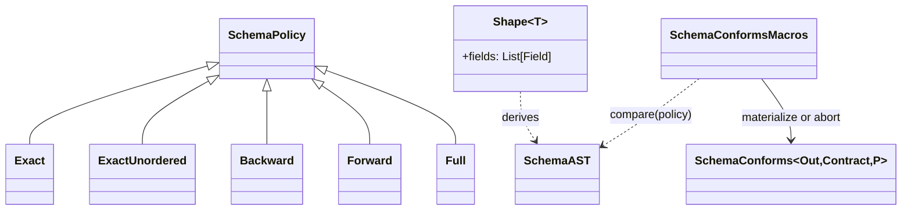
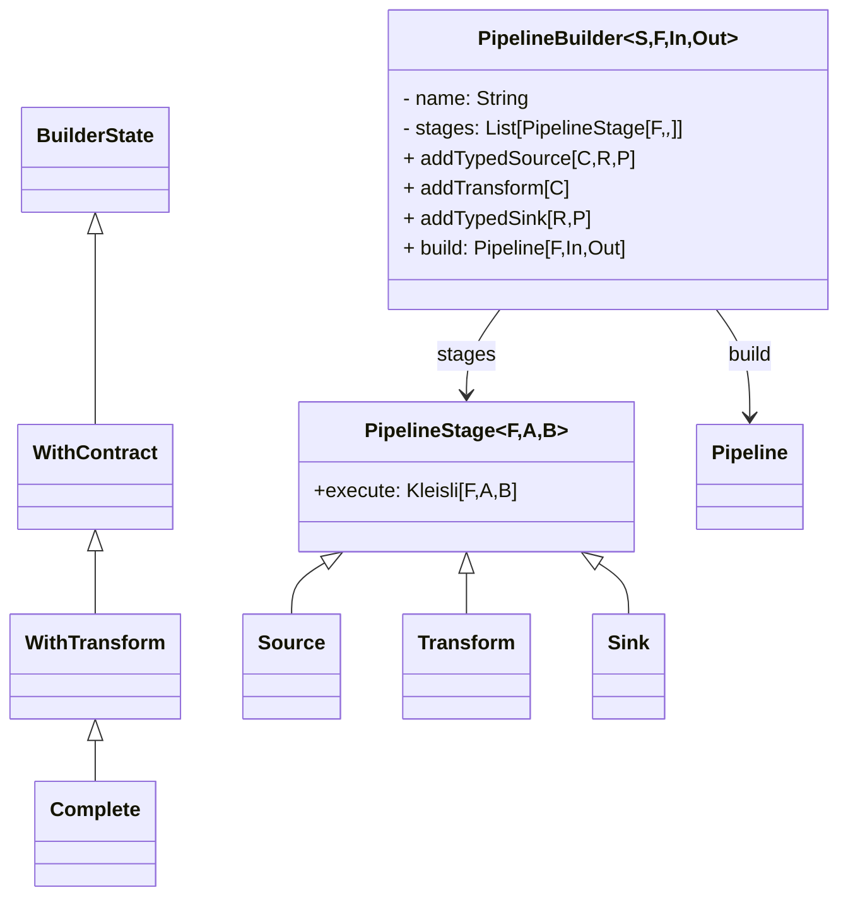
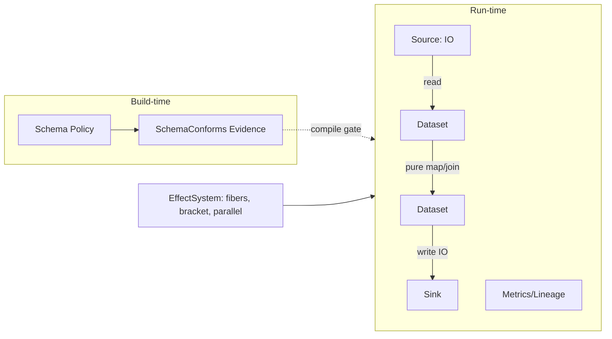
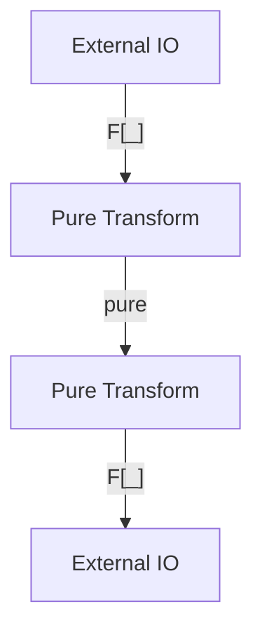
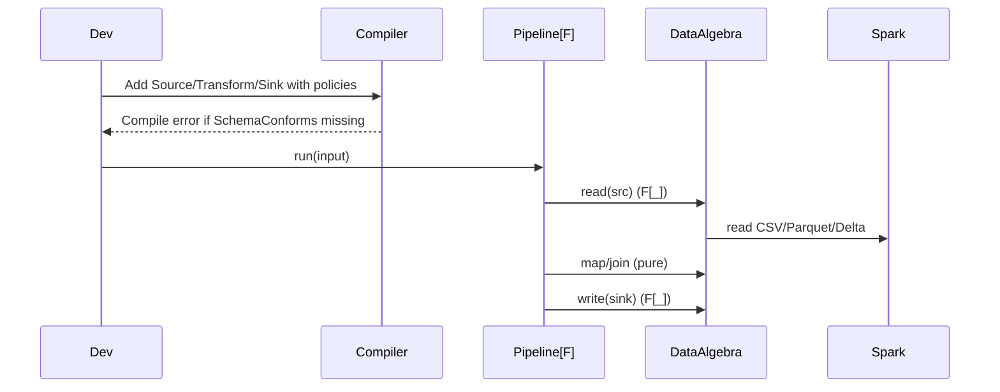

# Archived - Compile‑Time Contracts & Fiber‑Safe Data Pipelines (Scala)

> This deck is archived. Use the concept‑only talks instead:
> - docs/talks/talk-a-api-migration.md
> - docs/talks/talk-b-types-validation.md

> 45‑minute conference talk deck (Markdown). Brand‑agnostic; focuses on design, philosophy, and patterns. Code snippets are illustrative and trimmed for clarity. Speaker notes are comprehensive for rehearsal.

---

## Slide 1 - The Premise [~2 min]

- What if broken data pipelines didn’t start - they failed at compile time?
- What if orchestration respected fiber safety, and Spark transforms stayed pure?
- Today: A design blueprint for type‑first, effect‑aware data engineering in Scala.

> Speaker notes:
> - Open with a true story: a Friday night rollback due to silent schema drift (missing email column), and how the team only discovered it after dashboards turned red. Tie pain to audience memory.
> - Reframe: “What if these failures moved left of runtime - to the compiler?”
> - Promise: By the end, they’ll know the blueprint to make this their default.

---

## Slide 2 - Agenda & Timing (45 min) [~1 min]

- 5 min - Problem framing (pain → promise)
- 8 min - Contracts and policies (compile gates)
- 10 min - Effects, fibers, orchestration API (Kleisli)
- 8 min - Engine boundary (Spark) + runner abstraction (Flink)
- 8 min - DX: template + red→green, tests, DQ
- 6 min - Recommendations + Q&A buffer

> Speaker notes:
> - Keep a brisk pace: most time is on effects/orchestration and contracts. Reserve a couple of live red→green moments.

---

## Slide 3 - The Problem Landscape [~3 min]

- Schema drift discovered late; postmortems and “hotfix ETLs” abound
- Ad‑hoc side‑effects leak into transforms (network, JDBC, file IO)
- Orchestrators coordinate tasks but not effect safety or purity
- Spark jobs mix business logic with IO; tests are slow and brittle

> Speaker notes:
> - Emphasize that orchestration alone doesn’t ensure purity or effect safety. Most tools schedule tasks; few constrain side‑effects.
> - Testing pain: slow end‑to‑end tests stem from mixing IO with business logic.

---

## Slide 4 - Design Tenets (North Star) [~3 min]

- Contracts at the edges: producers/consumers encode schema, evolution policy
- Purity inside: transforms are referentially transparent
- Effect boundaries explicit: IO at edges, pure in the middle
- Orchestrate with fibers: concurrency, cancellation, resource safety
- Pluggable engines: Spark today; keep the algebra abstract

> Speaker notes:
> - Introduce the mantra: Contracts at the edges, purity in the middle, fibers for orchestration.
> - We’ll show the exact Scala features enabling each tenet.

---

## Slide 5 - Compile‑Time Contracts (Concept) [~5 min]



```scala
// Policy gate demo; compile‑fail when mismatched
final case class Consumer(id: Long, email: String)
final case class Producer(id: Long, email: String, age: Int)

// Requires Producer ~ Consumer under Exact → should NOT exist
implicitly[SchemaConforms[Producer, Consumer, SchemaPolicy.Exact]] // compile error

// Migration strategy: relax to Backward → compiles
implicitly[SchemaConforms[Producer, Consumer, SchemaPolicy.Backward]]
```

> Speaker notes:
> - Concept model: Policies (Exact/Backward/…) + Shape[T] (Magnolia) + SchemaAST + macro = compile‑time evidence.
> - The typeclass instance `SchemaConforms[Out, Contract, P]` is either derived or compilation aborts with diffs.
> - Demo flow: show red (`Exact`), then green (`Backward`) to illustrate intentional policy decisions during rollouts.

---

## Slide 5.1 - How Compile‑Time Contracts Actually Work [~4 min]

```mermaid
flowchart LR
  CC1[Case class: Out] --> SH1[Shape[Out] (Magnolia)]
  CC2[Case class: Contract] --> SH2[Shape[Contract] (Magnolia)]
  SH1 --> AST1[SchemaAST(Out)]
  SH2 --> AST2[SchemaAST(Contract)]
  AST1 --> CMP{Policy Compare}
  AST2 --> CMP
  CMP -->|OK| Ev[Materialize SchemaConforms]
  CMP -->|Diffs| Abort[[c.abort with Missing/Extra/Mismatched]]
```|```scala
// Macro essence
val outAst = Ast.of(weakTypeOf[Out])
val conAst = Ast.of(weakTypeOf[Contract])
val diff   = Compare.compareType(outAst, conAst, weakTypeOf[P], path = "")
if (diff.missing.nonEmpty || diff.extra.nonEmpty || diff.mismatched.nonEmpty)
  c.abort(c.enclosingPosition, render(diff))
q"new SchemaConforms[Out, Contract, P]{}"

// Magnolia shape derivation (fields, defaults, Option)
def join[T](cc: CaseClass[Shape, T]): Shape[T] = new Shape[T] {
  val fields = cc.parameters.toList.map { p =>
    Field(p.label, p.typeName.full, hasDefault = p.default.isDefined, isOptional = p.typeName.full.startsWith("scala.Option["))
  }
}
```

> Speaker notes:
> - Walk through the pipeline: case class → Magnolia → `Shape` → `SchemaAST` → policy compare.
> - Policies alter comparison semantics (order sensitivity, optional/default handling, positional match).
> - Point to strong error messages: Missing/Extra/Mismatched with paths (see docs/how-it-fails.md).

---

## Slide 6 - Contracts: The Building Blocks [~2 min]

- `SchemaPolicy` encodes evolution rules (Exact, ExactUnordered, Backward, Forward, Full)
- `SchemaConforms[Out, Contract, Policy]` is the evidence you must provide
- Policies as levers during migrations; compile‑time is your guardrail

```scala
// file: modules/core/.../SchemaPolicy.scala (conceptual)
sealed trait SchemaPolicy
object SchemaPolicy {
  sealed trait Exact           extends SchemaPolicy
  sealed trait ExactUnordered  extends SchemaPolicy
  sealed trait Backward        extends SchemaPolicy
  sealed trait Forward         extends SchemaPolicy
  sealed trait Full            extends SchemaPolicy
  // additional variants: ExactByPosition, case-insensitive variants, etc.
}
```

> Speaker notes:
> - Map each policy to a real rollout strategy. Backward = producers may add optional/defaulted fields.
> - Encourage teams to encode intent per boundary; CI enforces it.

---

## Slide 7 - A Contract‑Aware Pipeline Builder (Typestate) [~4 min]

```mermaid
flowchart LR
  E[Empty] -->|addTypedSource (SchemaConforms[C,R,P])| C[WithContract]
  C -->|addTransform (Out => F[C])| T[WithTransform]
  T -->|addTypedSink (SchemaConforms[Out,R,P])| X[Complete]
  X -->|build| Pipe[Pipeline[F,In,Out]]
```|```scala
// modules/core/.../PipelineBuilder.scala (trimmed)
case class PipelineBuilder[S, F[_]: EffectSystem, In, Out](
  name: String,
  stages: List[PipelineStage[F, _, _]] = Nil,
  lineageEmitter: Option[OpenLineageEmitter[F]] = None
) {
  def addTypedSource[C, R, P <: SchemaPolicy](src: TypedSource[R], reader: DataSource => F[C])
    (implicit ev: SchemaConforms[C, R, P]): PipelineBuilder[WithContract, F, Unit, C] = { /* add Source stage */ }

  def addTransform[C](f: Out => F[C])
    (implicit ev: S <:< WithContract): PipelineBuilder[WithTransform, F, In, C] = { /* add Transform stage */ }

  def addTypedSink[R, P <: SchemaPolicy](sink: TypedSink[R], writer: (Out, DataSink) => F[Unit])
    (implicit ev1: S <:< WithTransform, ev2: SchemaConforms[Out, R, P])
    : PipelineBuilder[Complete, F, In, Out] = { /* add Sink stage */ }

  def build(implicit ev: S <:< Complete): Pipeline[F, In, Out] = {
    // Compose stages: foldLeft(Kleisli.ask) and andThen each stage.execute
    val k: Kleisli[F, In, Out] = {
      object KC { def kAny(k: Kleisli[F, _, _]) = k.asInstanceOf[Kleisli[F, Any, Any]] }
      val ka: Kleisli[F, Any, Any] = stages.foldLeft(Kleisli.ask[F, Any])((acc, st) => acc.andThen(KC.kAny(st.execute)))
      ka.asInstanceOf[Kleisli[F, In, Out]]
    }
    Pipeline(k, PipelineMetadata.single(name))
  }
}
```

> Speaker notes (audience‑centric):
> - Builder wraps stage addition with compile‑time schema proofs. TypedSource/TypedSink carry `Shape[T]` via implicits; evidence `SchemaConforms` is required at the boundary methods.
> - Design goal: prevent invalid pipelines from existing. The typestate (`S`) encodes construction progress so `build` only appears when complete.
> - Runtime assembly uses Kleisli composition; no reflection needed. `lineageEmitter` can hook per‑stage events.

---

## Slide 7.1 - Builder Internals (Deeper Dive) [~3 min]


```scala
// Stage ADT (trimmed)
sealed trait PipelineStage[F[_], -A, B] { def execute: Kleisli[F, A, B] }
object PipelineStage {
  final case class Source[F[_], B](execute: Kleisli[F, Unit, B]) extends PipelineStage[F, Unit, B]
  final case class Transform[F[_], A, B](execute: Kleisli[F, A, B]) extends PipelineStage[F, A, B]
  final case class Sink[F[_], A](execute: Kleisli[F, A, Unit]) extends PipelineStage[F, A, Unit]
}

// Build composition (essence)
val kleisliAny: Kleisli[F, Any, Any] =
  stages.foldLeft(Kleisli.ask[F, Any])((acc, st) => acc.andThen(st.execute.asInstanceOf[Kleisli[F, Any, Any]]))
val pipeline: Pipeline[F, In, Out] = Pipeline(kleisliAny.asInstanceOf[Kleisli[F, In, Out]], md)
```

> Speaker notes:
> - The builder is a thin, type‑safe DSL over a list of `PipelineStage`s. Each stage is a Kleisli; composition is just `andThen`.
> - Phantom states align with construction steps. Evidence requirements live on `addTypedSource` and `addTypedSink`.
> - The output is a concrete `Pipeline[F, In, Out]` ready for orchestrators and combinators.

---

## Slide 8 - Effect System Abstraction (One API, Many Runtimes) [~3 min]

- Thin type class captures essentials: map/flatMap, async, fibers, parallelism, timing, bracket
- Implemented for Cats‑Effect IO and ZIO Task

```scala
// file: modules/core/.../EffectSystem.scala (trimmed)
trait EffectSystem[F[_]] extends MonadError[F, Throwable] {
  trait Fiber[F[_], A] { def cancel: F[Unit]; def join: F[A] }
  def start[A](fa: F[A]): F[Fiber[F, A]]
  def parTraverse[A,B](as: List[A])(f: A => F[B]): F[List[B]]
  def bracket[A,B](acquire: F[A])(use: A => F[B])(release: A => F[Unit]): F[B]
  def timeout[A](fa: F[A], d: FiniteDuration): F[A]
}
```

> Speaker notes:
> - This is Tagless‑Final over `F[_]`: we abstract, then provide instances (IO, ZIO Task).
> - Why not re‑export full Cats‑Effect? We keep the minimal surface we need (bracket, fibers, parallelism, timeout) to stay engine‑agnostic.

---

## Slide 9 - Fibers, Cancellation, Parallelism (Instances) [~2 min]

```scala
// file: modules/core/.../EffectInstances.scala (IO & ZIO snippets)
// Cats-Effect
def start[A](fa: IO[A]): IO[Fiber[IO, A]] = fa.start.map(CatsEffectFiber(_))
// ZIO
def start[A](fa: Task[A]): Task[Fiber[Task, A]] = fa.fork.map(ZIOFiber(_))
```

- Unified API → consistent orchestration semantics
- Enables safe `race`, `racePair`, `parTraverse`, backoff retries

> Speaker notes:
> - Show that `Fiber.cancel`/`join` exist uniformly, so supervisors can enforce lifecycles.
> - Mention `retryWithBackoff` helper; cancellation safety with `bracket`/`guarantee`.

---

## Slide 10 - Orchestrate with Kleisli Pipelines [~4 min]


```mermaid
flowchart LR
  subgraph Pipeline
    A[Pipeline[F,A,B]] --> C[Pipeline[F,B,C]]
    A -- andThen --> C
  end
  par[parallel] -->|inputs A| A
  par -->|inputs A| C
  out[(Pipeline[F,A,(B,C)])]
  A & C --> out
```

```scala
// Data structure and types
final case class Pipeline[F[_], A, B](run: Kleisli[F, A, B], metadata: PipelineMetadata)
// A = input type, B = output type, F[_] = your effect system
// metadata: name, stage list, counters, tags for observability

// Parallel combinator signature (trimmed)
def parallel[F[_]: EffectSystem, A, B, C](
  left: Pipeline[F, A, B],
  right: Pipeline[F, A, C]
)(combine: (B, C) => Pipeline[F, A, (B, C)]): Pipeline[F, A, (B, C)]

// Implementation essence
val run = Kleisli { a: A =>
  // run left and right in parallel on the same input `a`
  EffectSystem[F].parProduct(left.run(a), right.run(a)).flatMap {
    case (b, c) => combine(b, c).run(a)
  }
}
```

> Speaker notes (how to narrate the code):
> - Define `Pipeline[F, A, B]`: a Kleisli from input `A` to output `B` in effect `F`, plus `metadata` (name, stages, counts) used for tracing/metrics.
> - Emphasize higher‑kinded `F[_]`: this is where Cats‑Effect IO or ZIO Task plugs in; orchestration is effect‑polymorphic.
> - Walk signature of `parallel`: two pipelines sharing the same input `A` producing `B` and `C`, and a `combine` function that, given `(B, C)`, returns a new `Pipeline[F, A, (B, C)]` to keep context `A` available.
> - Explain the implementation: use `parProduct` to launch both runs in parallel on the same input `a`; once both complete, `combine(b, c)` yields a new pipeline that still expects `a` (so we `run(a)` again to stay on the same input context).
> - Call out correctness properties: types ensure you can’t accidentally mix inputs; fibers and cancellation semantics come from `EffectSystem`.

- Compose effectful stages with `Kleisli[F, A, B]`
- Add monitoring, retries, batching, parallel branches

```scala
// file: modules/core/.../framework/PipelineCombinators.scala (trimmed)
final case class Pipeline[F[_], A, B](run: Kleisli[F, A, B], metadata: PipelineMetadata)
object PipelineCombinators {
  def parallel[F[_]: EffectSystem, A, B, C](l: Pipeline[F, A, B], r: Pipeline[F, A, C])(
    combine: (B, C) => Pipeline[F, A, (B, C)]): Pipeline[F, A, (B, C)] = {
    val F = EffectSystem[F]
    Pipeline(Kleisli(a => F.parProduct(l.run(a), r.run(a)).flatMap { case (b,c) => combine(b,c).run(a) }), ...)
  }
}
```

> Speaker notes:
> - Treat this as the “runner” that composes business steps.
> - Highlight `parallel` combinator and metadata tracking (names, tags) for observability.

---

## Slide 11 - Pure vs Effectful: The Boundary [~2 min]

- Rule: pure transforms return `Dataset[A]` (no `F[_]`)
- IO (read/write, lineage, config, DQ) use `F[_]`

```scala
// file: modules/core/.../DataAlgebra.scala (trimmed)
trait DataAlgebra[F[_]] {
  // IO boundaries
  def read[A: DataDecoder](src: DataSource): F[Dataset[A]]
  def write[A: DataEncoder](ds: Dataset[A], sink: DataSink, opts: WriteOptions = WriteOptions.default): F[WriteResult]
  // Pure transforms
  def map[A,B: DataEncoder](ds: Dataset[A], f: A => B): Dataset[B]
  def join[A,B,K,C: DataEncoder](l: Dataset[A], r: Dataset[B], lk: A => K, rk: B => K, c: (A,B) => C): Dataset[C]
}
```

> Speaker notes:
> - Rule of thumb: if it touches the outside world, it’s `F[_]`. If it transforms records, it’s pure.
> - This cuts test time dramatically - unit tests run without Spark sessions.

---

## Slide 12 - Engine Implementation (Spark) [~2 min]

```mermaid
flowchart LR
  read[read: F[Dataset[A]]] --> ds1[(Dataset[A])]
  ds1 -->|pure map/join| ds2[(Dataset[B])]
  ds2 --> write[write: F[WriteResult]]
  classDef io fill:#ffd,stroke:#333,stroke-width:1px;
  read:::io; write:::io
```
```scala
// IO boundary (edges)
def read[A: DataDecoder](src: DataSource): F[Dataset[A]] = F.blocking { spark.read... }
def write[A: DataEncoder](ds: Dataset[A], sink: DataSink): F[WriteResult] = F.blocking { ... }

// Pure transforms (middle)
def map[A,B: DataEncoder](ds: Dataset[A], f: A => B): Dataset[B] =
  ProductionSparkDataset.fromData(ds.data.map(f), spark)
```

> Speaker notes:
> - Reiterate the boundary: only read/write/lineage/DQ touch `F[_]`; transforms remain pure `Dataset[_]`.
> - Testing benefit: inner logic unit‑tests don’t need Spark; engines are integration‑tested.

- Real Spark reads/writes; pure ops don’t require `F[_]`

```scala
// file: modules/engines-spark/.../SparkDataAlgebra.scala (trimmed)
override def read[A: DataDecoder](src: DataSource): F[Dataset[A]] = F.blocking {
  val df = src.format match {
    case CSV => spark.read.option("header","true").csv(src.location)
    case Parquet => spark.read.parquet(src.location)
    case Delta => spark.read.format("delta").load(src.location)
  }
  ProductionSparkDataset.fromDataFrame[A](df, spark)
}

// PURE transform
override def map[A,B: DataEncoder](ds: Dataset[A], f: A => B): Dataset[B] =
  ProductionSparkDataset.fromData(ds.data.map(f), spark)
```

> Speaker notes:
> - Call out `F.blocking` for Spark IO, pure transforms returning `Dataset[A]`.
> - Note DQ hooks and metrics recording inside the engine write path.

---

## Slide 12.1 - Trait‑Based Runners (Spark, Flink, Kafka) [~2 min]

- Keep engines behind the `DataAlgebra[F]` trait; business logic doesn’t depend on Spark/Flink.
- Flink implementation delegates to an in‑memory algebra while exposing engine config knobs - proving runner swap.

Code (Flink algebra, trimmed):

```scala
// modules/engines-flink/.../FlinkDataAlgebra.scala (trimmed)
final class FlinkDataAlgebra[F[_]](implicit F: EffectSystem[F]) extends DataAlgebra[F] {
  private val delegate = new com.flowforge.core.impl.InMemoryDataAlgebra[F]()
  override def read[A: DataDecoder](src: DataSource): F[Dataset[A]] = delegate.read(src)
  // ... all methods forward ...
}
```

> Speaker notes:
> - Explain “trait‑based runner”: the same `Pipeline` composes over `DataAlgebra[F]`; you choose engine at wiring time.
> - Mention connectors (Kafka/JDBC/etc.) and how their effects stay at the edges.

---

## Slide 13 - Resource Safety Everywhere [~2 min]

- Acquire/use/release via bracket; effect‑agnostic `FlowforgeResource` (name elided)

```scala
// file: modules/core/.../FlowforgeResource.scala (trimmed)
trait Resource[F[_], R] { def use[B](f: R => F[B]): F[B] }
object Resource {
  def make[F[_], R](acq: F[R])(rel: R => F[Unit])(implicit F: EffectSystem[F]): Resource[F, R] =
    new Resource[F, R] { def use[B](f: R => F[B]) = F.bracket(acq)(f)(rel) }
}
```

- Infrastructure layer exposes resource‑safe helpers for cloud/db/files

```scala
// file: modules/infrastructure/.../InfrastructureLayer.scala (trimmed)
trait ResourceSafety[F[_]] {
  def bracket[A,B](acquire: F[A])(use: A => F[B])(release: A => F[Unit]): F[B]
}
```

---

## Slide 14 - Diagram: Golden Path [~1 min]



> Speaker notes:
> - Walk from left to right. Stress that the compiler blocks drift; runtime becomes a deployment detail.

---

## Slide 15 - Diagram: Effect Boundaries [~1 min]



> Speaker notes:
> - Call out that failure surfaces are at IO blocks; transforms stay deterministic and easily property‑tested.

---

## Slide 16 - Data Quality: Native + Deequ (Optional) [~2 min]

- Constraints DSL: NotNull, Unique, Range, Pattern, Distinctness, NullRateBelow, Min/Max.
- Default path runs native Spark checks; optional Deequ 2.0+ via reflection (no hard dep) when enabled.

Code (adapter, trimmed):

```scala
// modules/quality-deequ/.../DeequAdapter.scala (trimmed)
def runChecks[A](spark: SparkSession, ds: Dataset[A], cs: List[QualityConstraint]): QualityResult[Dataset[A]] =
  ds match {
    case p: ProductionSparkDataset[A] =>
      if (deequeAvailable && sys.props.get("ff.quality.mode").contains("deequ")) runDeequVerification(...)
      else runNativeChecks(p.sparkDataFrame, cs, ds)
    case _ => QualityResult(ds, passed = true, violations = Nil, score = 1.0)
  }
```

> Speaker notes:
> - Show “lean by default, enterprise when needed”.
> - Native checks cover the 80%; Deequ unlocks richer rules without coupling core to a specific library.

Diagram (DQ flow):

```mermaid
flowchart LR
  DS[Dataset[A]] -->|constraints| DQ{DQ Engine}
  DQ -->|native Spark| Report[QualityResult]
  DQ -->|if enabled: Deequ| Report
```

---

## Slide 17 - Observability Hooks (Minimal, Practical) [~1 min]

- Timing wrappers and results capture around pipeline execution

```scala
// file: modules/core/.../framework/PipelineExecution.scala (trimmed)
object PipelineExecution {
  def execute[F[_]: EffectSystem, A, B](p: Pipeline[F, A, B])(in: A): F[B] = p.run(in)
  def executeBatch[F[_]: EffectSystem, A, B](p: Pipeline[F, A, B])(ins: List[A]): F[List[B]] =
    EffectSystem[F].parTraverse(ins)(p.run.run)
}
```

---

## Slide 18 - Parallel & Retry Combinators [~2 min]

```scala
// file: modules/core/.../framework/PipelineCombinators.scala (trimmed)
val retried: Pipeline[F, A, B] = retry(base, maxRetries = 3, initialDelay = 200.millis)
val batched: Pipeline[F, List[A], List[B]] = batch(listPipeline, batchSize = 1000)
```

- Keep orchestration declarative; reuse the effect system for robustness

---

## Slide 19 - Template Strategy (DX) [~2 min]

- Scaffold a project with typed contracts and CI gates
- “Red → Green” demo: start with a deliberate mismatch; fix policy/types to compile

```scala
// compile-fail test pattern (trimmed)
assertTypeError("implicitly[SchemaConforms[Producer, Consumer, SchemaPolicy.Exact]]")
```

> Speaker note: A template isn’t magic - it encodes defaults that make the right thing easy.

---

## Slide 20 - Example Walkthrough (5 min) [~3 min]

- Minimal pipeline: typed source → pure transform → typed sink

```scala
// file: template app (trimmed)
final case class User(id: Long, email: String, age: Int)
val src  = TypedSource[User](DataSource.local("data/users.csv", DataFormat.CSV))
val sink = TypedSink[User](DataSink.local("out/users", DataFormat.Parquet))

val p = PipelineBuilder[IO]("users")
  .addTypedSource[User, User, SchemaPolicy.Exact](src, _ => IO.pure(User(0L, "a@b", 0)))
  .addTransform[User](u => IO.pure(u.copy(age = u.age.max(0))))
  .addTypedSink[User, SchemaPolicy.Exact](sink, (ds, d) => dao.write(ds, d).void)
  .build()
```

> Speaker note: Highlight where contracts enforce correctness and where effects live.

---

## Slide 21 - Migration & Evolution [~2 min]

- Start “Exact” → relax to “Backward/Forward” during staged rollouts
- Compile gates make drift explicit; CI enforces policy intent

> Speaker note: Explain policy diffs as deliberate decisions, not accidents.

---

## Slide 22 - Testing Strategy [~2 min]

- Unit test pure transforms quickly
- Property and contract tests at the edges
- Parallel batch execution in tests via `parTraverse`

> Speaker note: Time budget of CI goes to the edges, not inner loops.

---

## Slide 23 - From Blueprint to Platform [~1 min]

> Speaker notes:
> - Summarize extensibility vectors: add engines by implementing the `DataAlgebra[F]` trait; add effect systems by providing `EffectSystem` instances; add DQ providers behind an adapter.

- Algebra for data ops; plug engines (Spark now, others later)
- Effect instances allow Cats‑Effect or ZIO; pick one per service
- Infrastructure helpers for resource safety and config

> Speaker note: Keep the core small; grow via modules.

---

## Slide 24 - Live Diagram: Putting It Together [~1 min]



---

## Slide 25 - Recommendations (Do This) [~1 min]

- Make contracts first‑class and versioned
- Separate pure logic from IO; enforce effect boundaries in APIs
- Orchestrate with a fiber‑aware effect system
- Keep engines behind an algebra; test with minimal fakes

---

## Slide 26 - Anti‑Patterns (Avoid This) [~1 min]

- “Just parse JSON at the edges” without compile gates
- Embedding network calls inside Spark `map`
- Orchestration that ignores cancellation/resource scope
- Runtime schema discovery as a substitute for contracts

---

## Slide 27 - What’s Next [~1 min]

- Templates that encode these defaults (contract gates in CI)
- Pluggable quality adapters (native checks or external libs)
- More engines (Flink/Kafka) behind the same algebra

> Speaker note: We’re building and will release an open framework after this talk.

---

## Slide 28 - Q&A [~5 min]

- Ask about migrations, CI wiring, or engine swaps
- Happy to share examples and templates

---

## Appendix A - Additional Snippets

Effect backoff retry (conceptual):
```scala
EffectSystem[F]
  .retryWithBackoff(dao.write(data, sink), maxRetries = 5, initialDelay = 100.millis)
```

Parallel branch orchestration:
```scala
val L: Pipeline[F, A, B] = ...
val R: Pipeline[F, A, C] = ...
val P: Pipeline[F, A, (B,C)] = parallel(L, R){ (b,c) => Pipeline.pure(a => (b,c), name = "zip") }
```

---

## Appendix C - File References (for later sharing)

---

## Scala Cheatsheet - Features & Patterns (with speaker notes)

- Phantom Types: `BuilderState` enforces construction order with zero runtime cost.
- Tagless Final: `EffectSystem[F[_]]`, `DataAlgebra[F[_]]`, log/metrics traits keep effects abstract.
- Macros + Magnolia: `SchemaConforms` macro + `Shape` derivation build `SchemaAST` at compile time.
- Type Classes: `DataEncoder/Decoder`, `EffectSystem`, metrics/logging adapters enable pluggability.
- Kleisli Composition: Pipelines are `Kleisli[F, A, B]` with combinators (parallel, retry, batch).
- GADTs (advanced): `GADTPipeline` shows heterogeneous compositions without casts.
- Refined Types: Stronger config and identifiers (e.g., `FieldName`) at compile time.

> Speaker notes:
> - When asked “why Scala for data engineering”, anchor answers here. Tie each bullet to slides: contracts (5.x), typestate (7), effects (8–10), engines (12.x), DQ (16).

---

## Appendix D - FAQ / Q&A Prep (with references)

1) How expensive are compile‑time contracts?
- Answer: All checks occur at compile time via macros; runtime cost is zero at boundaries. Error messages are generated once. See modules/core/src/main/scala/com/flowforge/core/contracts/internal/SchemaConformsMacros.scala:1 and derive/Shape.scala:1.

2) Do policies support order sensitivity and case‑insensitive fields?
- Answer: Yes; variants include ExactOrdered, ExactUnordered, positional, and CI variants. See SchemaConformsMacros compare branches.

3) Can I evolve a schema without breaking consumers?
- Answer: Use Backward (producers may add optional/defaulted fields) or Forward (consumers tolerate missing). Slide 6; code in SchemaPolicy.scala.

4) How do we prevent side‑effects from leaking into transforms?
- Answer: The algebra separates pure ops from IO. Only read/write/lineage/DQ carry `F[_]`. See modules/core/.../DataAlgebra.scala:85–140 and Spark engine implementations around 620–740.

5) What’s the orchestrator really built on?
- Answer: Kleisli pipelines with effect‑aware combinators (parallel, retry, batch). See modules/core/.../framework/PipelineCombinators.scala:1.

6) How do fibers/cancellation translate across IO and ZIO?
- Answer: Uniform `EffectSystem` with `Fiber` abstraction and instances. modules/core/.../algebra/EffectSystem.scala:205–246 and instances in modules/core/.../instances/EffectInstances.scala:160–220, 337–405.

7) Can I switch runners (Spark→Flink) without rewriting logic?
- Answer: Yes; logic targets `DataAlgebra[F]`. FlinkDataAlgebra shows delegation; SparkDataAlgebra provides full engine. See modules/engines-flink/FlinkDataAlgebra.scala:1 and modules/engines-spark/SparkDataAlgebra.scala.

8) How is Data Quality integrated without a heavy dependency?
- Answer: Native Spark checks by default; optional Deequ via reflection flag `-Dff.quality.mode=deequ`. See modules/quality-deequ/DeequAdapter.scala:1.

9) Where do templates enforce red→green?
- Answer: Compile‑fail tests using `assertTypeError/Compiles` and a sample pipeline with typed endpoints. See flowforge.g8/src/main/g8/src/test/.../PolicyCompileFailSpec.scala:1 and app PipelineApp.scala.

10) How do I unit test pipelines quickly?
- Answer: Test pure transforms as ordinary functions. Use in‑memory datasets with the algebra; use `parTraverse` for batch tests. See DataAlgebra pure methods and PipelineExecution.executeBatch.

11) What about configuration and refined types?
- Answer: Config decoders validate early; refined types (e.g., `FieldName`) constrain at compile time. See modules/core/.../types/RefinedTypes and config layer modules/infrastructure.

12) Can we express heterogeneous stage pipelines safely?
- Answer: Yes, via the GADT pipeline (advanced) - no casts, type‑witnessed composition. See modules/core/.../types/GADTPipeline.scala:1.

13) Does this work with Kafka streaming?
- Answer: Connectors/Kafka module provides the edge; same `DataAlgebra[F]` approach applies (IO at edges, pure in middle). Wire at the engine/connector boundary.

14) How do retries and timeouts behave with Spark jobs?
- Answer: Implemented via `EffectSystem.retryWithBackoff`/`timeout`; use with IO boundaries (read/write). See EffectSystem.scala:520–720 and combinators.

15) How is resource safety guaranteed for sessions and files?
- Answer: `bracket`/`guarantee` and effect‑agnostic `Resource` wrapper; InfrastructureLayer adds helpers for cloud/db. See FlowforgeResource.scala:14–23 and InfrastructureLayer.scala:120–246.

---

## Appendix E - Live Demo Script (copy‑paste ready)

Prereqs
- Java 17+, sbt 1.9+, local Spark runtime OK for template demo.
- This repo checked out (for the template path). Run from a clean terminal.

1) Generate a fresh project (60–90s)
```bash
export FF_G8=/absolute/path/to/flowforge/flowforge.g8
sbt new file://$FF_G8 <<'EOF'
name
scalaio-demo
organization
com.example
package
com.example
EOF
cd scalaio-demo
```

2) Green baseline: build (30s)
```bash
sbt clean compile
# Expected: [success] Total time: ...
```

3) RED: introduce a contract drift (compile should fail) (90s)
- Open `src/main/scala/com/flowforge/app/PipelineApp.scala`.
- Just above the existing `final case class User(...)`, paste:
```scala
final case class Producer(id: Long, email: String, age: Int)
```
- Change the typed source in the builder from:
```scala
.addTypedSource[User, User, SchemaPolicy.Exact](typedSrc, _ => IO.pure(User(0L, "a@b", 0)))
```
to the RED version:
```scala
.addTypedSource[Producer, User, SchemaPolicy.Exact](typedSrc, _ => IO.pure(Producer(0L, "a@b", 0)))
```
- Now re‑compile:
```bash
sbt compile
```
Expected output (shape):
```text
[error] ... SchemaConforms[Producer, User, Exact] ...
[error] Missing: <none>
[error] Extra: age:Int
[error] Mismatched: <none>
[error] FlowForge: Contract drift (policy: Exact). Out: Producer vs Contract: User ...
```

4) GREEN: relax policy to Backward (or make age optional) (60s)
- Change the red line to:
```scala
.addTypedSource[Producer, User, SchemaPolicy.Backward](typedSrc, _ => IO.pure(Producer(0L, "a@b", 0)))
```
- Re‑compile:
```bash
sbt compile
# Expected: success
```
Alternative: keep `Exact`, but change `Producer.age: Option[Int]` or give a default value; re‑compile → success.

5) Run the tiny pipeline (90s)
```bash
sbt "runMain com.flowforge.app.PipelineApp"
```
Expected logs (shape):
```text
[info] ... pipeline_started
[info] DQ passed with score 1.0
[info] effects_demo sum=... closed=true
[info] pipeline_completed
```

6) Optional: Flip DQ engine to Deequ (if available) (30s)
```bash
sbt -Dff.quality.mode=deequ "runMain com.flowforge.app.PipelineApp"
# Expected: same pass/fail semantics; Deequ used under the hood if on classpath
```

Cleanup
```bash
cd .. && rm -rf scalaio-demo
```


- modules/core/algebra/EffectSystem.scala
- modules/core/instances/EffectInstances.scala
- modules/core/algebra/DataAlgebra.scala
- modules/engines-spark/SparkDataAlgebra.scala
- modules/core/framework/PipelineCombinators.scala
- modules/core/framework/PipelineExecution.scala
- modules/core/PipelineBuilder.scala
- flowforge.g8/src/main/g8/src/test/.../PolicyCompileFailSpec.scala

> Speaker note: Share a repo mirror or gist after the session; avoid brand names in slides.
