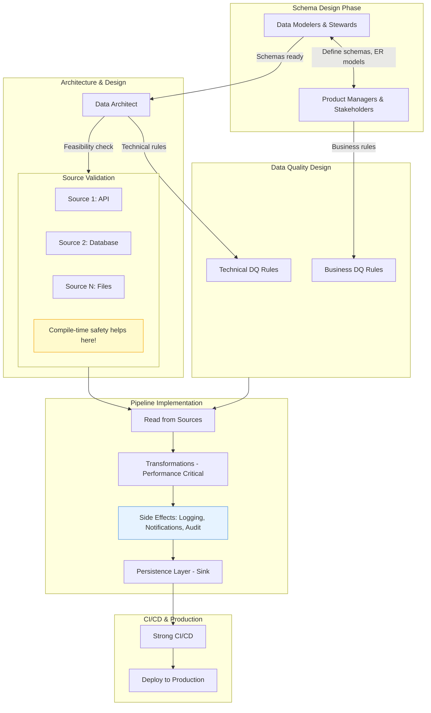
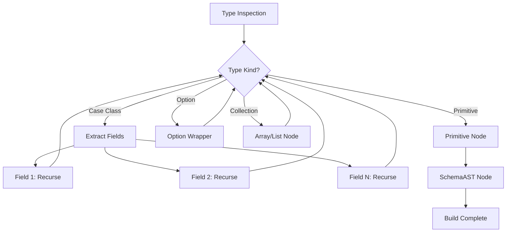
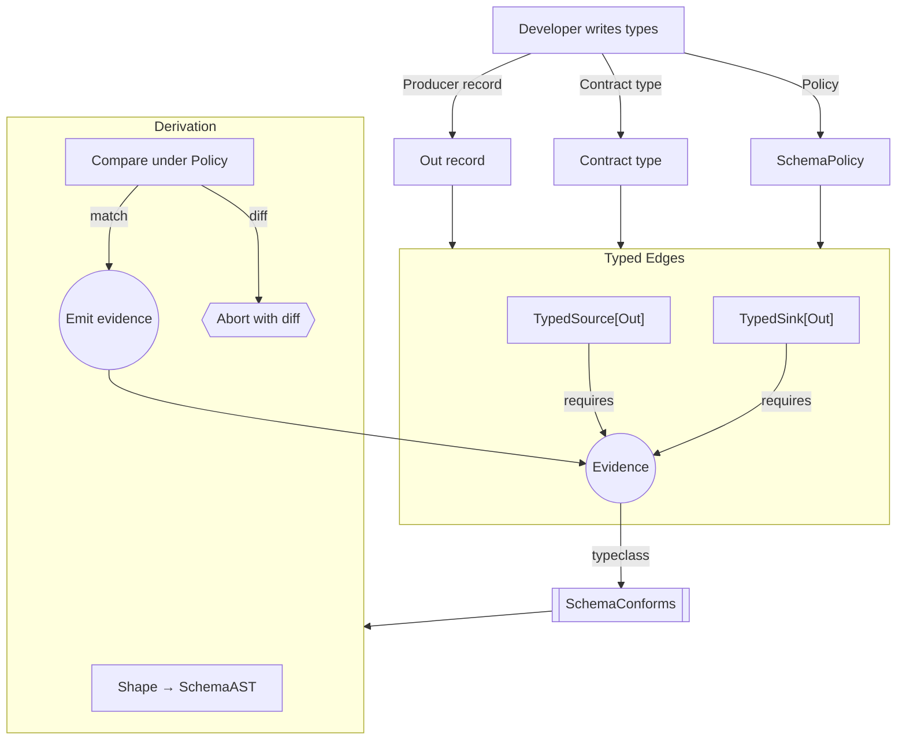
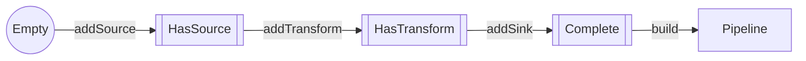
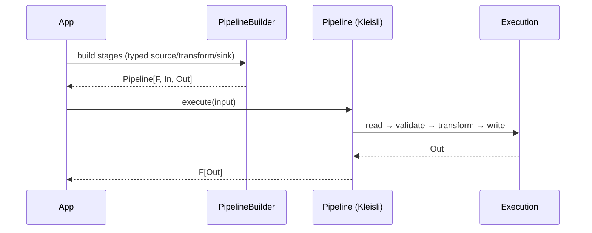
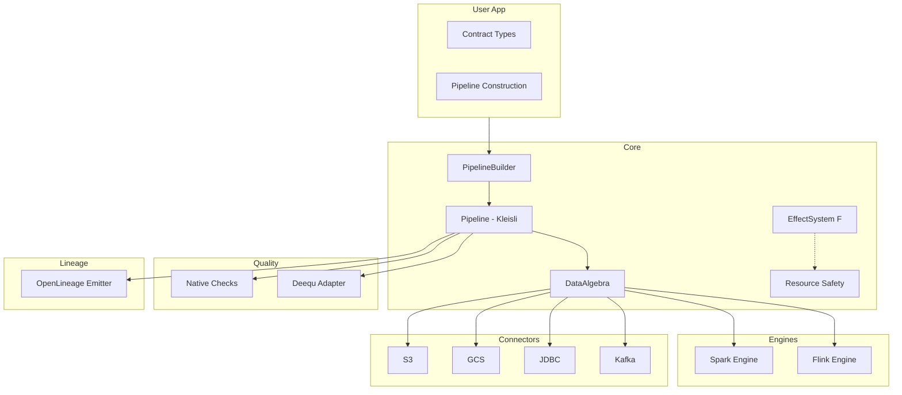

# ScalaIO 2025 – Compile-time data contracts & Fiber-safe data pipelines

> Canonical deck for ScalaIO Paris 2025. Built around WHY → HOW → WHAT, aligned with the organizer’s posted description (`docs/talks/ScalaIO-Paris-2025-Talk-Description-Pitch.md`).

## Title slide
- **Title:** Compile-time data contracts & Fiber-safe Data pipelines
- **Subtitle:** Let the compiler refuse broken migrations; let fibers keep retries safe.
- Mention ScalaIO Paris 2025, speaker name, role.

## S01a – About me
- Staff Data Engineer @ Walmart, Offices in India
- From Mumbai, India
- 10+ years building data platforms at scale (Deloitte → Walmart)
- I cook good Indian food
- Visit: https://vitthalmirji.com

## S01b – About Walmart (context)
- Global retail scale: diverse sources, strict SLAs/compliance, mixed batch & streaming workloads
- Practical constraints: schema evolution under change, idempotency at edges, reproducible rollbacks
- These constraints motivated compile‑time guarantees and fiber‑safe execution

## S01c – Data Engineering Reality (Getting Up to Speed)
**The typical data engineering workflow:**



**Where compile-time contracts & fiber-safe execution fit:**
- **Sources:** Compile-time prevents schema drift across many varied sources
- **Quality:** Both technical & business DQ rules validated at compile + runtime
- **Transform:** Pure functions for performance
- **Effects:** Side effects (logging, notifications, audit) kept at edges—fiber-safe
- **Sink:** Strong persistence guarantees with idempotent retries
- **CI/CD:** Compile-fail tests gate deployments

## S01 – Scars, beliefs & stakes
**The Scar Story (60 seconds, deliver verbatim):**

> "Three months ago, an upstream team renamed `amount` to `amt` in a microservice we consume. No one told us. Our Spark job didn't crash—it just wrote `null` for every transaction amount. For three weeks.
>
> We only caught it during month‑end reconciliation when Finance couldn't close the books. We burned a weekend backfilling 47 million rows. I had to present a postmortem to leadership explaining why a column rename cost us significant engineer time and delayed financial reporting by 5 days.
>
> **If the build had failed on that schema diff, none of that would have happened.**"

**[Pause. Beat. Let it land.]**

**Promise:** By the end of this talk, you'll know how to move drift, effect leaks, and rollback risk to compile/build time—so you never present that postmortem.

## S02 – Boundaries we must name
**Two critical distinctions:**

1. **Compile-time vs Runtime**
   - Compile-time: structural contracts + builder typestate + illegal construction
   - Runtime: corrupt files, SLA breaches, retries, lineage, data quality

2. **DX vs Process**
   - DX: fast local red→green loops
   - Process: CI policy gates + compile-fail PR checks

**When to use which:**

| Problem Type | Compile-Time Solution | Runtime Solution |
|--------------|----------------------|------------------|
| Schema drift within your repo | ✅ Macro evidence | ❌ Too late |
| External API changed schema | ❌ Can't control their build | ✅ Schema registry + alerts |
| Corrupt file (missing rows) | ❌ Not a structural issue | ✅ DQ checks |
| Forgot to wire a sink | ✅ Typestate builder | N/A |

**Remember:** "Compiler buys sleep; runtime guardrails deal with the world's messiness."

## S02a – Boundary checkpoint (mini, to repeat later)
- Compile‑time stops drift and illegal construction.
- Runtime handles corrupt files, SLA breaches, retries, lineage.
- DX = fast local red→green. Process = CI policy gates + compile‑fail PR checks.

## S03 – Why Data contracts come first
**Policy lattice** (Exact | Backward | Forward | Full with Ordered/CI/By-Position modifiers):

```scala
sealed trait SchemaPolicy
object SchemaPolicy {
  sealed trait Exact extends SchemaPolicy      // Schemas must match exactly
  sealed trait Backward extends SchemaPolicy   // Producer adds optional fields
  sealed trait Forward extends SchemaPolicy    // Consumer ignores extras
}
```

**Policy Comparison Table:**

| Policy  | Missing Fields                        | Extra Fields | Type Mismatch | Field Order       | Name Case |
|---------|---------------------------------------|--------------|---------------|-------------------|-----------|
| Exact   | ❌ reject                             | ❌ reject    | ❌ reject     | As configured     | As is     |
| Backward| ⚠ allow if optional/defaulted (producer adds) | ✅ allow     | ❌ reject     | Flexible          | As is     |
| Forward | ✅ allow (consumer tolerates missing) | ❌ reject    | ❌ reject     | Flexible          | As is     |
| Full    | ✅ allow                              | ✅ allow     | ✅ allow      | Flexible          | Flexible  |

**Modifiers:** Ordered, CI (Case-Insensitive), By-Position

**Emphasize:** Policies encode intent; compile proof is the go/no-go button.

**Code reference:** `modules/contracts/.../SchemaPolicy.scala`

## S04 – Compile-time evidence pipeline
**What you write (user-facing API):**
```scala
summon[SchemaConforms[Out, Contract, SchemaPolicy.Exact]]
```

**What happens (the macro):**
1. Case class → Magnolia Shape → Schema AST
2. Policy Compare (Exact/Backward/Forward rules)
3. Emit `SchemaConforms` evidence OR compile error with precise diff

**Macro TypeRepr Recursion:**



**Compile-Time Evidence Flow:**



**Example compile error:**
```
[error] Compile-time contract drift (policy: SchemaPolicy.Exact)
[error] Out: CustomerProducer vs Contract: CustomerContract
[error] Extra: segment
[error] Missing:
[error] Mismatched:
```

**Key insight:** Compiler errors pinpoint the exact field/path that drifted—no grepping logs at 2 AM.

**Code reference:** `modules/contracts/.../SchemaConformsMacro.scala`
**Blog deep-dive:** `compile-time-data-contracts` (2025-09-30)

## S05 – Red → Green migration demo
**THIS IS THE MONEY SLIDE. "This is where we get Friday night back."**

**Setup - Define types with drift:**

```scala
// Contract expects: id, email
case class Contract(id: Long, email: String)

// Producer has EXTRA field: age
case class Producer(
  id: Long,
  email: String,
  age: Int
)
```

**❌ RED: Exact policy REFUSES the drift**

```scala
// Attempt to use Exact policy with mismatched schemas
val _ = implicitly[SchemaConforms[Producer, Contract, SchemaPolicy.Exact]]
```

**Compiler error:**
```
[error] Compile-time contract drift (policy: SchemaPolicy.Exact)
[error] Out: Producer vs Contract: Contract
[error] Extra: age: Int
[error] Missing: (none)
[error] Mismatched: (none)
```

**✅ GREEN: Backward policy ALLOWS the migration**

```scala
// Relax to Backward policy - producer may add optional fields
val _ = implicitly[SchemaConforms[Producer, Contract, SchemaPolicy.Backward]]
```

**Compiles successfully! ✅**

**Key takeaway:** The compiler pinpoints the exact field (`age: Int`) that drifted—no log grepping at 2 AM. You choose when to relax the policy for safe migrations.

**Reference:** `modules/examples/.../CompileConformanceDemo.scala`

## S06 – Templates & golden path + Typestate builder safety
**Show:** `sbt new flowforge.g8` scaffolding

**What gets generated:**
```scala
// Generated: src/main/scala/Pipeline.scala
val pipeline = PipelineBuilder[IO]("example")
  .addTypedSource[Producer, Contract, SchemaPolicy.Backward](source, reader)
  .addTransform[Contract](transform)
  .addTypedSink[Contract, SchemaPolicy.Exact](sink, writer)
  .build  // ✅ Only compiles when Complete
```

**Typestate prevents incomplete pipelines:**



**❌ This WON'T compile:**
```scala
val broken = PipelineBuilder[IO]("incomplete")
  .addTypedSource[Producer, Contract, SchemaPolicy.Backward](source, reader)
  .addTransform[Contract](transform)
  // Missing .addSink
  .build  // ❌ Compile error: required BuilderState.Complete
```

**Batteries included:**
- Generated compile-fail tests + policy defaults
- Onboarding doc: `docs/getting-started-quick.md`

**Key insight:** Illegal states are unrepresentable—compiler refuses incomplete pipelines.

**Reference:** `flowforge.g8/README.md`, `modules/examples/.../TypestateRefusal.scala`

## S07 – Configuration safety
- Typed config decoder pattern (`modules/infrastructure/.../ConfigurationManagement.scala`).
- Refined types for config keys (`modules/core/types/ConfigTypes.scala`, `DataTypes.scala`), using `eu.timepit.refined`.
- ValidatedNel aggregation for multi-rule violations.
- Message: “Config fails fast; no more ‘missing S3 bucket’ at runtime.”

## S08 – Functional validation & Data quality
- Show `ValidatedNel` aggregations for DQ checks (`modules/core/types/PipelineTypes.scala`).
- Connect to organizer bullet: Cats `ValidatedNel` for multi-rule violations.
- Mention optional Deequ integration (`modules/quality-deequ`).

## S09a – Effect boundary (pure inside, effects at edges)
**Connection to contracts:**
> "Contracts prove the schema *before* you run. Now let's talk about keeping pipelines *composable* and *testable* while you run. Both are type-level guarantees—one for structure, one for effects."

**Core principle:**
- **Pure inside:** Transforms are `A => B` (map/filter)—no side effects
- **Effects at edges:** Read/write/stream are `A => F[B]` where `F[_]` captures IO

**Why it matters:** Retries are safe; tests don't need real databases; logic is portable.

## S09b – Kleisli composition (effectful glue)
**The problem:** `A => F[B]` functions don't compose like regular functions.

**The solution:** `Kleisli[F, A, B]` wraps `A => F[B]` and makes it composable.

**Example:**
```scala
val read:      Kleisli[IO, Unit, In]
val transform: Kleisli[IO, In, Out]
val write:     Kleisli[IO, Out, Unit]

val pipeline = read andThen transform andThen write
```

**Pipeline execution flow:**



**Effect-polymorphic design:** Use `F[_]: Async` so the same code runs on Cats Effect or ZIO.

**Key insight:** Kleisli turns `A => F[B]` into composable pipelines—write once, run on any effect system.

**Code reference:** `modules/core/.../PipelineBuilder.scala`
**Blog deep-dive:** "Kleisli for Data Engineering" (2025-10-08)

## S10 – Fiber-safe execution & Effect options
**Translate "fiber" for data engineers:**

> "Fibers are lightweight threads. When a pipeline stage fails, you want **retries to be safe** (no duplicate writes) and **cancellation to be clean** (no leaked resources). Cats Effect and ZIO give you this via structured concurrency."

**Dual effect support:**
- Cats Effect + ZIO (`docs/effects/bring-your-own-effect.md`)
- Capability algebra → interpreter per effect system
- Minimal effect interface: `modules/core/algebra/EffectSystem.scala`

**Fiber-aware orchestration:**
- Cancellation propagates cleanly
- Resource safety (files, connections) guaranteed
- Retries don't duplicate side effects

**Visual:** Capability→interpreter diagram (`docs/talks/assets/fiber-safe.svg`)

**Optional:** Experimental Kyo/Caprese explorations (appendix only)

## S11 – Batteries included
**Pick ONE to show:** Compile-fail test matrix (CI gate that saves you)

**Example:** Policy matrix test
```scala
// This test MUST fail to compile - it's the gate
"[error] Backward policy rejects missing required fields"
assertDoesNotCompile("""
  summon[SchemaConforms[Missing, Contract, SchemaPolicy.Backward]]
""")
```

**Runs in CI** → If this test passes (schema drift compiles), CI fails the PR.

**Reference:** `modules/compile-fail-tests/.../SchemaPolicyMatrixSpec.scala`

**Other batteries (mention only):**
- Contract macros emit human diff (missing/extra/mismatch with paths)
- `ff-validate-schema` CLI catches Spark/Hive/Delta/Avro/Protobuf drift before deploy
- GCS connector (effect-safe blocking + typed errors)
- OpenLineage emitter (sync/async/noop for Marquez)

**Avro/Protobuf integration:** This works *on top of* Avro/Proto—it checks that your case classes match the wire schema.

## S12 – Engine portability seam
**Audience question:** "Wait, does this only work on Spark?"

**Answer (30 seconds):**
> "The algebra separates *what* you do (read/transform/write) from *how* you run it. Swap `SparkRunner` for `FlinkRunner` and the same pipeline code runs on Flink. The appendix has the proof if you're curious."

**Key insight:** Pipeline code stays the same; choose the interpreter at wiring time.

**Code references:**
- `modules/engines-spark`
- `modules/engines-flink`

**Deep-dive:** `docs/talks/appendix-engine-portability.md`

## S13 – Runtime guardrails
**FlowForge architecture layers:**



**Runtime capabilities:**
- **Infrastructure layer:** Resource safety, typed config, metrics, tracing
- **Data Quality:** Native checks + optional Deequ integration (`modules/quality-deequ`)
- **Lineage:** OpenLineage emitter (sync/async/noop for Marquez)
- **Idempotent edges:** Retry-safe operations at read/write boundaries

**Reinforce the boundary:** "Compiler blocks drift; runtime manages corrupt files & SLA breaches."

**Code references:**
- `modules/infrastructure/.../InfrastructureLayer.scala`
- `modules/core/.../lineage/OpenLineageEmitter.scala`

## S13a – Boundary checkpoint (interactive recap, 1 min)
**Pop quiz for the audience:**

> "Does compile-time catch corrupt CSV files?"
> **[Pause. Let them answer.]**
> "No—that's runtime."

> "Does it catch schema drift in your repo?"
> **[Pause. Let them answer.]**
> "Yes—that's compile-time."

**Repeat the boundary:**
- **Compile‑time** stops drift and illegal construction
- **Runtime** handles corrupt files, SLA breaches, retries, lineage
- **DX** = fast local red→green | **Process** = CI policy gates + compile‑fail PR checks

## S14 – Outcome takeaways
**Lead with feelings, then mechanisms:**

1. **Stop getting paged at 2 AM** because schema drift dies before deploy
   - *How:* Drift fails at compile time, not in production

2. **Go from hours of log-grepping to seconds of compiler errors**
   - *How:* Compiler errors point at the exact field/path that drifted

3. **Keep traders, analysts, and finance teams out of war rooms**
   - *How:* Retries are fiber-safe and idempotent at the edges; SLAs protected

## S15 – Remember WHY ?
- Visuals: Drop three single-message circles (`why-01-protect-sleep.svg`, `how-01-contracts.svg`, `what-06-quality.svg`) or swap in the variants that fit your story.
- “We do this to keep traders, analysts, and on-call engineers out of war rooms.”
- “Compile gates buy confidence; runtime guardrails keep reality in check.”
- “Join us if you refuse to debug schema drift at 02:00 ever again.”

## S16 – Invitation (not pitch)
**Frame as proof, not product:**

> "We built [FlowForge](https://github.com/vim89/flowforge) to prove these ideas work at scale. The repo is public—try `sbt new flowforge.g8`, run the red→green demo, and share your stories. **The ideas belong to you; the code is just a reference.**"

**Incremental adoption:**
- Start with one pipeline
- Add evidence at the sink
- Run compile-fail tests in CI
- You don't need to convert everything at once

**Callback to S01 (close the loop):**
> "No more 2 AM pages. No more postmortems to leadership. No more burned weekends backfilling data. **Just pipelines that refuse to break in the first place.**"

## Presentation notes (no separate IDE demos)
**All code examples and diagrams are embedded in slides above.**

**Key slides with code/diagrams:**
- **S03:** Policy comparison table (Exact/Backward/Forward/Full)
- **S04:** Mermaid flowchart showing compile-time evidence pipeline
- **S05:** Red→Green code example (Exact fails, Backward succeeds) - **MONEY SLIDE**
- **S06:** Typestate builder Mermaid diagram + compile error example
- **S09b:** Kleisli composition sequence diagram
- **S13:** FlowForge architecture diagram (layered flowchart)

**Presenter delivery tips:**
1. **S05 (Red→Green):** Walk through code slowly; point at error message fields
2. **S04 & S13:** Let diagrams breathe; don't rush the visuals
3. **S06:** Emphasize "compiler refuses `.build`" for incomplete pipelines
4. **Timing:** Target 35 min for S01-S16, leaving 10 min buffer before Q&A

**No live coding required—everything is in slides with precise error messages and working examples.**

## Appendix references
- Engine portability: `docs/talks/appendix-engine-portability.md`
- Migration timeline (4-week schema evolution playbook): Week 1 (Backward policy), Week 4 (tighten to Exact), Week 6 (sunset old schema)
- Experimental Kyo/Caprese: `docs/archive/brainstorming/flowforge/kyo-caprese.md`
- Quality checklist: `docs/quality/release-criteria.md`
- Blog posts: `compile-time-data-contracts` (2025-09-30), `kleisli-data-engineering` (2025-10-08)
