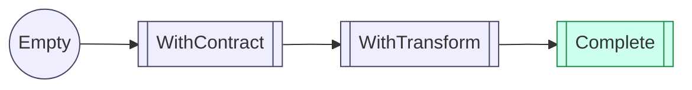

# Typestate Builder - Slide Source (Export to PNG)

Annotations
- build() only from Complete
- addSource → addTransform → addSink → build
- Illegal states are unrepresentable; incomplete graphs never build

Export this diagram to PNG and use as the typestate slide.

