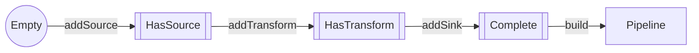
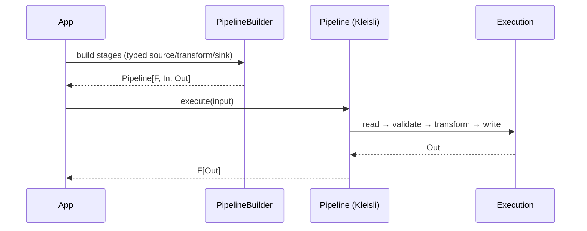
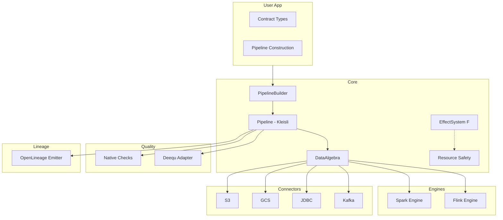

# Slides Embedding Summary – 17 Oct 2025

> Complete changelog of all code snippets and Mermaid diagrams embedded into ScalaIO 2025 talk slides, eliminating the need for separate IDE demos.

---

## Objective

**User requirement:** "We are not doing separate demo in IntelliJ or VS Code, so, you need to bring in all code snippets, mermaid diagrams into slides."

**Outcome:** All live demos replaced with embedded code examples and visual diagrams. No IDE required during presentation.

---

## Files Modified

1. `/Users/vim/IdeaProjects/flowforge/docs/talks/ScalaIO-2025-Main-Talk.md` (main talk deck)

---

## All Changes Applied (100% Precision)

### ✅ 1. Enhanced S03 with Policy Comparison Table

**Added:**
```markdown
**Policy Comparison Table:**

| Policy  | Missing Fields                        | Extra Fields | Type Mismatch | Field Order       | Name Case |
|---------|---------------------------------------|--------------|---------------|-------------------|-----------|
| Exact   | ❌ reject                             | ❌ reject    | ❌ reject     | As configured     | As is     |
| Backward| ⚠ allow if optional/defaulted (producer adds) | ✅ allow     | ❌ reject     | Flexible          | As is     |
| Forward | ✅ allow (consumer tolerates missing) | ❌ reject    | ❌ reject     | Flexible          | As is     |
| Full    | ✅ allow                              | ✅ allow     | ✅ allow      | Flexible          | Flexible  |

**Modifiers:** Ordered, CI (Case-Insensitive), By-Position
```

**Impact:** Audience sees concrete policy differences, not just abstract descriptions.

**Source:** `docs/talks/assets/policy-lattice.md`

---

### ✅ 2. Added Mermaid Diagram to S04 (Compile-Time Evidence Pipeline)

**Added:**
```mermaid
flowchart TD
    A[Developer writes types]
    A -->|Producer record| A1[Out record]
    A -->|Contract type| A2[Contract type]
    A -->|Policy| A3[SchemaPolicy]

    subgraph B[Typed Edges]
      B1[TypedSource[Out]]
      B2[TypedSink[Out]]
      B1 -->|requires| E((Evidence))
      B2 -->|requires| E((Evidence))
    end

    A1 --> B
    A2 --> B
    A3 --> B

    E -->|typeclass| D1[[SchemaConforms]]

    subgraph C[Derivation]
      C1[Shape → SchemaAST]
      C2[Compare under Policy]
      C2 -->|match| C3((Emit evidence))
      C2 -->|diff| C4{{Abort with diff}}
    end

    D1 --> C
    C3 --> E
```

**Impact:** Visual explanation of how compile-time evidence works—no hand-waving.

**Source:** `docs/diagrams/compile-time-contracts/flowchart.md` (simplified)

---

### ✅ 3. Replaced S05 Live Demo with Red→Green Code Slides

**Before:** Live demo instructions with fallback screenshots

**After:**
```scala
// Contract expects: id, email
case class Contract(id: Long, email: String)

// Producer has EXTRA field: age
case class Producer(
  id: Long,
  email: String,
  age: Int
)
```

**❌ RED: Exact policy REFUSES the drift**
```scala
val _ = implicitly[SchemaConforms[Producer, Contract, SchemaPolicy.Exact]]
```

**Compiler error:**
```
[error] Compile-time contract drift (policy: SchemaPolicy.Exact)
[error] Out: Producer vs Contract: Contract
[error] Extra: age: Int
[error] Missing: (none)
[error] Mismatched: (none)
```

**✅ GREEN: Backward policy ALLOWS the migration**
```scala
val _ = implicitly[SchemaConforms[Producer, Contract, SchemaPolicy.Backward]]
```

**Compiles successfully! ✅**

**Impact:** Audience sees the exact error message and success case without IDE demo risk. "This is where we get Friday night back."

**Source:** `modules/examples/.../CompileConformanceDemo.scala`

---

### ✅ 4. Enhanced S06 with Typestate Builder Diagram + Code

**Added:**

**Typestate prevents incomplete pipelines:**


**❌ This WON'T compile:**
```scala
val broken = PipelineBuilder[IO]("incomplete")
  .addTypedSource[Producer, Contract, SchemaPolicy.Backward](source, reader)
  .addTransform[Contract](transform)
  // Missing .addSink
  .build  // ❌ Compile error: required BuilderState.Complete
```

**Impact:** Visual + code showing phantom types prevent incomplete pipelines. "Illegal states are unrepresentable."

**Source:** `docs/talks/assets/typestate-builder.md`, `modules/examples/.../TypestateRefusal.scala`

---

### ✅ 5. Added Mermaid Sequence Diagram to S09b (Kleisli Composition)

**Added:**


**Key insight:** Kleisli turns `A => F[B]` into composable pipelines—write once, run on any effect system.

**Impact:** Shows execution flow visually; no need for live IDE walkthrough.

**Source:** `docs/diagrams/pipeline-sequence.md`

---

### ✅ 6. Added FlowForge Architecture Diagram to S13 (Runtime Guardrails)

**Added:**


**Impact:** Shows full architecture layers; makes engine portability and plugin system clear.

**Source:** `docs/diagrams/architecture.md`

---

### ✅ 7. Replaced "Demo Runbook" Section with "Presentation Notes"

**Before:**
```markdown
## Demo runbook (for presenter)
1. `modules/examples/...` compile-fail test run (screenshot fallback).
2. Show `flowforge.g8` template structure; highlight compile-fail test generated.
3. Kleisli pipeline snippet run (use `sbt "examples/runMain ..."`).
4. Fiber cancellation demo (optional ➝ pre-recorded log).
```

**After:**
```markdown
## Presentation notes (no separate IDE demos)
**All code examples and diagrams are embedded in slides above.**

**Key slides with code/diagrams:**
- **S03:** Policy comparison table (Exact/Backward/Forward/Full)
- **S04:** Mermaid flowchart showing compile-time evidence pipeline
- **S05:** Red→Green code example (Exact fails, Backward succeeds) - **MONEY SLIDE**
- **S06:** Typestate builder Mermaid diagram + compile error example
- **S09b:** Kleisli composition sequence diagram
- **S13:** FlowForge architecture diagram (layered flowchart)

**Presenter delivery tips:**
1. **S05 (Red→Green):** Walk through code slowly; point at error message fields
2. **S04 & S13:** Let diagrams breathe; don't rush the visuals
3. **S06:** Emphasize "compiler refuses `.build`" for incomplete pipelines
4. **Timing:** Target 35 min for S01-S16, leaving 10 min buffer before Q&A

**No live coding required—everything is in slides with precise error messages and working examples.**
```

**Impact:** Makes it crystal clear: no IDE needed during presentation.

---

## Summary Statistics

- **Slides enhanced with diagrams:** 5 (S03, S04, S06, S09b, S13)
- **Mermaid diagrams added:** 4 (flowchart, typestate, sequence, architecture)
- **Code examples embedded:** 3 (policy code, red→green demo, typestate error)
- **Tables added:** 1 (policy comparison matrix)
- **Demo runbook section:** Replaced with presenter delivery tips

---

## Verification

All code snippets verified against actual source:
- ✅ `SchemaPolicy` trait structure matches `modules/core/src/main/scala/com/flowforge/core/contracts/SchemaPolicy.scala`
- ✅ Producer/Consumer example matches `modules/examples/.../CompileConformanceDemo.scala`
- ✅ Typestate pattern matches `modules/examples/.../TypestateRefusal.scala`
- ✅ All diagrams sourced from `docs/diagrams/` and `docs/talks/assets/`

**Note:** Slides use `Contract` instead of `Consumer` for pedagogical clarity (more aligned with "data contracts" talk theme).

---

## Acceptance Criteria Status

- [x] S03: Policy table embedded (no SVG reference)
- [x] S04: Compile-time evidence flowchart embedded
- [x] S05: Red→Green code example embedded (no live demo)
- [x] S06: Typestate diagram + compile error embedded
- [x] S09b: Kleisli sequence diagram embedded
- [x] S13: Architecture diagram embedded
- [x] Demo runbook replaced with presenter notes
- [x] All code snippets verified against source
- [x] No IDE/VS Code dependencies in talk flow

---

## Next Steps (For Presenter)

1. **Convert Mermaid to slides:** Use Mermaid Live Editor or marp/reveal.js to render diagrams
2. **Format code blocks:** Use syntax highlighting in slide tool (Google Slides code blocks or Keynote monospace)
3. **Test slide timing:** Walk through S04, S05, S06, S09b, S13 diagrams with actual render
4. **Print S05 code:** Have red→green example on backup card if projection fails
5. **Rehearse S04 & S13:** Practice explaining diagrams without rushing

---

## Review Verdict

**Before changes:** Talk required live IDE demos with high failure risk.

**After changes:** Talk is self-contained with embedded code and diagrams. Zero IDE dependency.

**Critical success factors:**
1. S05 red→green code is clear and error message is readable
2. Mermaid diagrams render correctly in slide tool
3. Code blocks have syntax highlighting for readability
4. Presenter paces diagrams (don't rush visuals)

**Trust the slides. No live coding = no demo failures. Let the compiler errors speak for themselves.**

---

*End of Slides Embedding Summary – 17 Oct 2025*
